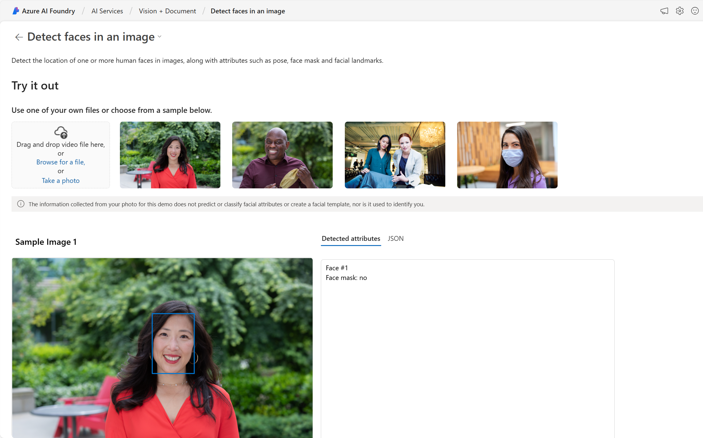
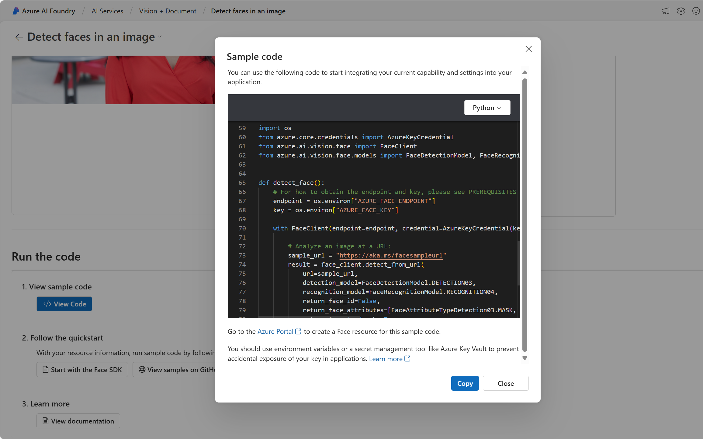

---
lab:
  title: "Explorer Azure\_AI Services"
---

# Explorer Azure AI Services

Azure AI services aide les utilisateurs à créer des applications avec des API et modèles prêts à l’emploi, prédéfinis et personnalisables. Dans cet exercice, vous allez créer une ressource dans le Portail Azure et tester les services Azure AI. L’objectif de cet exercice est d’avoir une compréhension générale de la manière dont les services Azure AI sont approvisionnés et utilisés.

## Créer une ressource *Azure AI Services* dans le portail Azure

1. Dans un onglet de navigateur, ouvrez le Portail Azure à l’adresse [https://portal.azure.com](https://portal.azure.com?azure-portal=true) et connectez-vous avec le compte Microsoft associé à votre abonnement Azure.

1. Cliquez sur le bouton **&#65291;Créer une ressource** et recherchez *Azure AI services*. Sélectionnez **créer** un plan **Azure AI services**. Vous accédez à une page pour créer une ressource Azure AI services. Configurez-la avec les paramètres suivants :
    - **Abonnement** : *votre abonnement Azure*.
    - **Groupe de ressources** : *sélectionnez ou créez un groupe de ressources portant un nom unique*.
    - **Région** : *Sélectionnez la région géographique la plus proche. Si vous êtes dans l’est des États-Unis, utilisez « USA Est 2 »*.
    - **Nom** : *entrez un nom unique.*
    - **Niveau tarifaire** : *Standard S0.*
    - **En cochant cette case, je reconnais avoir lu et compris toutes les conditions ci-dessous** : *Sélectionné*.

1. Sélectionnez **Vérifier + créer**, puis **Créer** et attendez la fin du déploiement.

    *Félicitations ! Vous venez de créer ou d’approvisionner une ressource Azure AI services. Celle que vous avez approvisionnée dans ce cas précis est une ressource multiservice.*

1. Une fois le déploiement effectué, sélectionnez *Accéder à la ressource*. 

## Examiner les clés et le point de terminaison

Pour intégrer les services Azure AI dans des applications, les développeurs ont besoin d’une clé de service et d’un point de terminaison. Les clés et le point de terminaison utilisés pour le développement d’applications se trouvent tous dans le portail Azure. 

1. Dans le portail Azure, sélectionnez votre ressource. Dans le menu de gauche, en dessous de *Gestion des ressources*, cherchez *Clés et points de terminaison*. Sélectionnez **Clés et points de terminaison** pour afficher le point de terminaison et les clés de votre ressource. 

## Consultez Azure AI Services en action.

Commençons par créer un projet Azure AI Foundry.

1. Dans un navigateur web, ouvrez le [portail Azure AI Foundry](https://ai.azure.com) à l’adresse `https://ai.azure.com` et connectez-vous en utilisant vos informations d’identification Azure. Fermez les conseils ou les volets de démarrage rapide ouverts lors de votre première connexion.
 
1. Dans une nouvelle fenêtre de navigateur, ouvrez la [page d’exploration des services Azure AI](https://ai.azure.com/explore/aiservices).

1. Dans la page *Services d’IA*, sélectionnez la vignette *Vision + Document* pour essayer les fonctionnalités Azure AI Vision et Document.

    

1. Sous *Afficher toutes les fonctionnalités Vision*, sélectionnez l’onglet **Visage**. 

1. Sélectionnez la vignette de démonstration *Détecter les visages dans une image*. 

1. Essayez le service Visage, qui est l’un des nombreux services Azure AI. Cliquez sur une image et consultez les attributs détectés. 

    

1. Faites défiler vers le bas jusqu’à la section **Exécuter le code**. Sélectionnez **Afficher le code**. Faites défiler jusqu’à la section qui commence par *import os*. Dans l’exemple de code fourni, vous verrez des espaces réservés où insérer la clé et le point de terminaison.

     

1. Si vous deviez créer une application utilisant les services Azure AI, vous pourriez commencer par le code fourni. En remplaçant les espaces réservés par la clé et le point de terminaison de votre propre service, votre application pourrait envoyer des requêtes et recevoir des réponses utilisant les services Azure AI. Dans le cas du service Visage, la *requête* consiste à demander au service Visage d’analyser l’image. La *réponse* correspond aux attributs détectés. 

    >**Remarque** : vous n’avez pas besoin de connaître la programmation pour effectuer les exercices de ce cours. Nous allons continuer à explorer les services Azure AI en action via le portail Azure AI Foundry.  
 
## Nettoyage 

Une fois que vous avez terminé, supprimez la ressource Azure AI Services dans le portail Azure. La suppression de la ressource est un moyen de réduire les coûts qui s’accumulent lorsque la ressource existe déjà dans l’abonnement. Pour cela, accédez à la page **Vue d’ensemble** de votre ressource Azure AI Services. En haut de l’écran, sélectionnez **Supprimer**.

