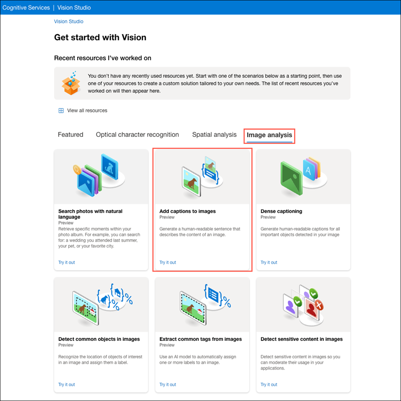

---
lab:
  title: Analyser les images dans Vision Studio
---

# Analyser les images dans Vision Studio 

**Azure AI Vision** regroupe de nombreuses fonctionnalités qui permettent de comprendre le contenu et le contexte des images et d’en extraire des informations. Azure AI Vision Studio vous permet de tester de nombreuses capacités d’analyse d’images. 

Dans cet exercice, vous allez utiliser Vision Studio pour analyser des images à l’aide des expériences d’essai intégrées. Supposons que la société de vente au détail fictive *Les Commerçants du Vent du Nord* ait décidé de mettre en place un « magasin intelligent », dans lequel des services d’IA supervisent la boutique afin d’identifier les clients qui ont besoin d’aide et d’orienter les employés pour qu’ils les assistent. Grâce à Azure AI Vision, les images prises par les caméras du magasin peuvent être analysées pour fournir des descriptions utiles de leur contenu.

## Créer une ressource *Azure AI services*

Vous pouvez utiliser les fonctionnalités d’analyse d’images d’Azure AI Vision avec une ressource multiservice d’**Azure AI Services**. Si ce n’est déjà fait, créez une ressource **Azure AI services** dans votre abonnement Azure.

1. Dans un autre onglet du navigateur, ouvrez le portail Azure à l’adresse [https://portal.azure.com](https://portal.azure.com?azure-portal=true) et connectez-vous avec le compte Microsoft associé à votre abonnement Azure.

1. Cliquez sur le bouton **&#65291;Créer une ressource** et recherchez *Azure AI services*. Sélectionnez **créer** un plan **Azure AI services**. Vous accédez à une page pour créer une ressource Azure AI services. Configurez-la avec les paramètres suivants :
    - **Abonnement** : *votre abonnement Azure*.
    - **Groupe de ressources** : *sélectionnez ou créez un groupe de ressources portant un nom unique*.
    - **Région** : USA Est.
    - **Nom** : *entrez un nom unique.*
    - **Niveau tarifaire** : *Standard S0.*
    - **En cochant cette case, je reconnais avoir lu et compris toutes les conditions ci-dessous** : *Sélectionné*.

1. Sélectionnez **Vérifier + créer**, puis **Créer** et attendez la fin du déploiement.

## Connectez votre ressource de service Azure AI à Vision Studio

Connectez ensuite la ressource Azure AI service que vous avez approvisionnée ci-dessus à Vision Studio.

1. Dans un autre onglet du navigateur, accédez à [Vision Studio](https://portal.vision.cognitive.azure.com?azure-portal=true).

1. Connectez-vous avec votre compte et assurez-vous que vous utilisez le même répertoire que celui dans lequel vous avez créé votre ressource Azure AI services.

1. Sur la page d’accueil de Vision Studio, sélectionnez **Afficher toutes les ressources** sous le titre **Démarrage avec Vision**.

    

1. Sur la page **Sélectionner une ressource à utiliser**, placez le curseur de votre souris sur la ressource que vous avez créée ci-dessus dans la liste, puis cochez la case à gauche du nom de la ressource et sélectionnez **Sélectionner comme ressource par défaut**.

    > **Remarque** : Si votre ressource n’est pas répertoriée, vous devrez peut-être **Actualiser** la page.

    

1. Fermez la page des paramètres en sélectionnant le « X » en haut à droite de l’écran.

## Générer des légendes pour une image

Vous êtes maintenant prêt à utiliser Vision Studio pour analyser les images prises par un appareil photo dans le boutique *Les Commerçants du Vent du Nord*.

Examinons la fonctionnalité qui permet de faire apparaître les légendes sur les images dans Azure AI Vision. Les légendes d’image sont accessibles via les fonctionnalités **Légende** et **Légendes denses**.

1. Dans un navigateur web, accédez à [Vision Studio](https://portal.vision.cognitive.azure.com?azure-portal=true).

1. Dans la page d’accueil **Démarrage avec Vision**, sélectionnez l’onglet **Analyse d’image**, puis la vignette **Ajouter des légendes aux images**.

    

1. Sous le sous-titre **Essayer**, acceptez la stratégie d’utilisation des ressources en lisant et en cochant la case.  

1. Sélectionnez [**https://aka.ms/mslearn-images-for-analysis**](https://aka.ms/mslearn-images-for-analysis) pour télécharger **image-analysis.zip**. Ouvrez le dossier sur votre ordinateur et localisez le fichier nommé **store-camera-1.jpg**, qui contient l’image suivante :

    

1. Chargez l’image **store-camera-1.jpg** en la faisant glisser vers la zone **Glisser-déposer des fichiers ici**, ou en la recherchant sur votre système de fichiers.

1. Observez le texte de la légende générée, visible dans le panneau **Attributs détectés** à droite de l’image.

    La fonctionnalité **Légende** fournit une phrase en anglais, facile à lire et qui décrit le contenu de l’image.

1. Utilisez ensuite la même image pour obtenir un **Texte de légende dense**. Revenez à la page d’accueil de **Vision Studio** et, comme vous l’avez fait précédemment, sélectionnez l’onglet **Analyse d’image**, puis sélectionnez la vignette **Texte de légende dense**.

    La fonctionnalité **Texte de légende denses** diffère de la fonctionnalité **Légende** car elle fournit plusieurs légendes faciles à lire pour une image, dont l’une décrit le contenu de l’image et les autres décrivent les objets principaux détectés dans l’image. Chaque objet détecté dispose d’un cadre englobant qui définit les coordonnées des pixels de l’image associés à l’objet.

1. Placez le curseur de la souris sur l’une des légendes dans la liste des attributs **Détectés** et observez ce qui se passe dans l’image.

    

    Déplacez le curseur de votre souris sur les autres légendes de la liste et observez comment le cadre se déplace dans l’image pour mettre en évidence la partie de l’image utilisée pour générer la légende.

## Étiquetage des images

La fonctionnalité suivante que vous allez essayer est la fonctionnalité **Extraire des étiquettes**. Extraire des étiquettes est basé sur des milliers d’objets reconnaissables, y compris des êtres vivants, des paysages et des actions.

1. Retournez à la page d’accueil de Vision Studio, puis sélectionnez la vignette **Extraire les étiquettes courantes des images** sous l’onglet **Analyse d’images**.

2. Dans la section **Choisir le modèle que vous souhaitez essayer**, ne décochez pas l’option **Produit prédéfini et modèle différentiel**. Dans le champ **Choisissez votre langue**, sélectionnez **Anglais** ou la langue de votre choix.

3. Ouvrez le dossier qui contient les images que vous avez téléchargées et recherchez le fichier nommé **store-image-2.jpg**, qui ressemble à ceci :

    

4. Chargez le fichier **store-camera-2.jpg**.

5. Passez en revue la liste des balises extraites de l’image et le score de confiance pour chacune d’entre elles dans le panneau des attributs détectés. Le score de confiance correspond ici à la probabilité que le texte de l’attribut détecté décrive réellement ce qui se trouve dans l’image. Remarquez dans la liste des étiquettes qu’elle inclut non seulement des objets, mais aussi des actions, telles que *faire des achats*, *vendre*et *se tenir debout*.

    

## Détection d’objets

Dans cette tâche, vous utilisez la fonctionnalité **Détection d’objet** de Analyse d’images. La détection d’objets permet de détecter et d’extraire des cadres englobants sur la base de milliers d’objets et d’êtres vivants reconnaissables.

1. Retournez à la page d’accueil de Vision Studio, puis, sous l’onglet **Analyse d’images**, sélectionnez la vignette **Détecter les étiquettes courantes des images**.

1. Dans la section **Choisir le modèle que vous souhaitez essayer**, ne décochez pas l’option **Produit prédéfini et modèle différentiel**.

1. Ouvrez le dossier qui contient les images que vous avez téléchargées et recherchez le fichier nommé **store-image-3.jpg**, qui ressemble à ceci :

    

1. Chargez le fichier **store-camera-3.jpg**.

1. Dans la zone **Attributs détectés**, observez la liste des objets détectés et leurs scores de confiance.

1. Passez le curseur de votre souris sur les objets de la liste **Attributs détectés** pour mettre en surbrillance le cadre englobant de l’objet dans l’image.

1. Déplacez le curseur de **Valeur du seuil** jusqu’à ce qu’une valeur de 70 soit affichée à droite du curseur. Observez ce qui se passe avec les objets de la liste. Le curseur de seuil spécifie que seuls les objets identifiés avec un score de confiance ou une probabilité supérieure au seuil doivent être affichés.

## Nettoyage

Si vous n’avez pas l’intention d’effectuer plus d’exercices, supprimez les ressources dont vous n’avez plus besoin. Cela évite d’accumuler des coûts inutiles.

1.  Ouvrez le [portail Microsoft Azure]( https://portal.azure.com) et sélectionnez le groupe de ressources qui contient la ressource que vous avez créée. 
1.  Sélectionnez la ressource, puis sélectionnez **Supprimer**, puis **Oui** pour confirmer. La ressource est alors supprimée.

## En savoir plus

Pour en savoir plus sur ce que vous pouvez faire avec ce service, consultez la [page Azure AI Vision](https://learn.microsoft.com/azure/ai-services/computer-vision/overview).
