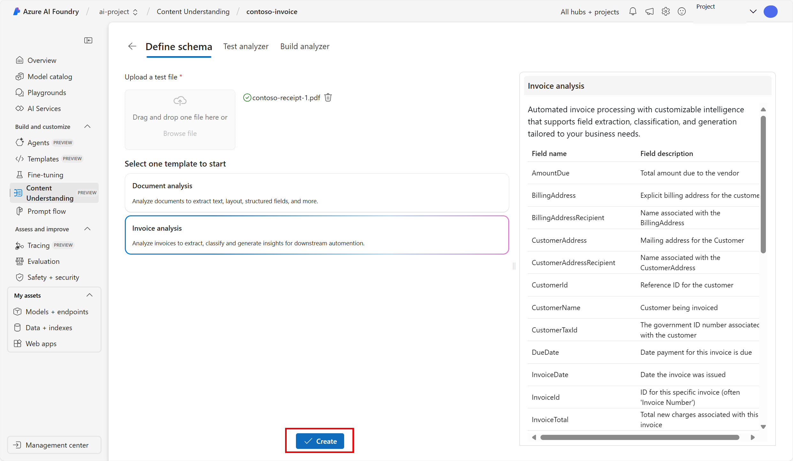
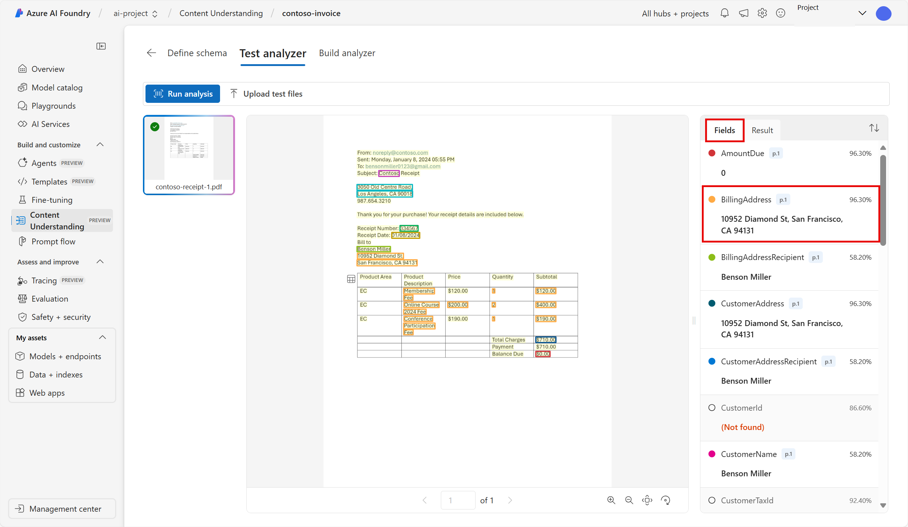
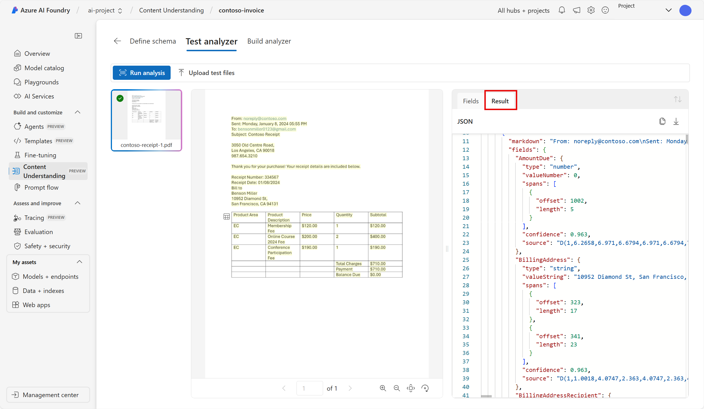
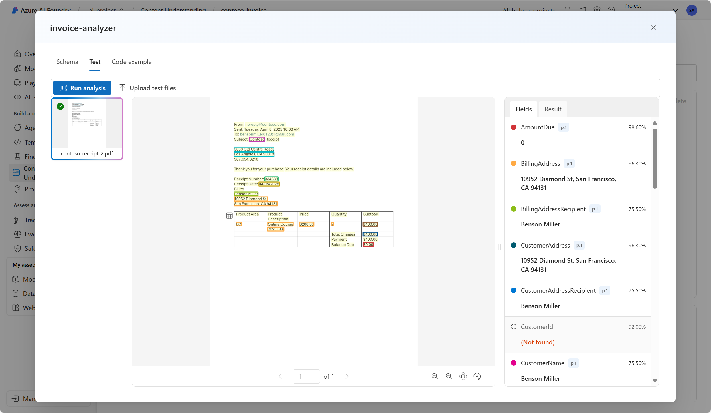
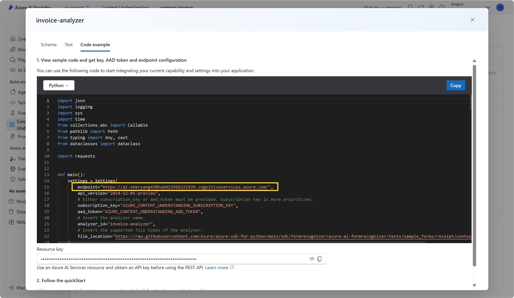

---
lab:
  title: "Extraire des données avec Compréhension de contenu dans le portail Azure\_AI\_Foundry"
---

# Extraire des données avec Compréhension de contenu dans le portail Azure AI Foundry

**Compréhension de contenu Azure AI (préversion)** utilise l’IA générative pour traiter divers types de contenu (documents, images, vidéos et audio) et les convertir dans un format de sortie défini par l’utilisateur.

Dans cet exercice, vous allez utiliser Compréhension de contenu Azure AI dans le portail Azure AI Foundry, la plateforme de Microsoft pour la création d’applications intelligentes, pour extraire des données à partir de factures. 

Cet exercice dure environ **25** minutes.

## Créer un projet Azure AI Foundry

Commençons par créer un projet Azure AI Foundry.

1. Dans un navigateur web, ouvrez le [portail Azure AI Foundry](https://ai.azure.com) à l’adresse `https://ai.azure.com` et connectez-vous en utilisant vos informations d’identification Azure. Fermez les conseils ou les volets de démarrage rapide ouverts la première fois que vous vous connectez et, si nécessaire, utilisez le logo **Azure AI Foundry** en haut à gauche pour accéder à la page d’accueil, qui ressemble à l’image suivante (fermez le volet **Aide** s’il est ouvert) :

    

1. Sur la page d’accueil, sélectionnez **+Créer un projet**.

1. Dans l’assistant **Créer un projet**, saisissez un nom valide et, si un hub existant est suggéré, choisissez l’option permettant d’en créer un. Passez ensuite en revue les ressources Azure qui seront créées automatiquement pour prendre en charge votre hub et votre projet.

1. Sélectionnez **Personnaliser** et spécifiez les paramètres suivants pour votre hub :
    - **Nom du hub** : *un nom valide pour votre hub*
    - **Abonnement** : *votre abonnement Azure*
    - **Groupe de ressources** : *créez ou sélectionnez un groupe de ressources*
    - **Emplacement** : USA Ouest 
    - **Connecter Azure AI Services ou Azure OpenAI** : *créer une nouvelle ressource AI Services*
    - **Connecter la Recherche Azure AI** : ignorer la connexion

1. Sélectionnez **Suivant** et passez en revue votre configuration. Sélectionnez **Créer** et patientez jusqu’à ce que l’opération se termine.

1. Une fois votre projet créé, fermez les conseils affichés et passez en revue la page du projet dans le portail Azure AI Foundry, qui doit ressembler à l’image suivante :

    
 
1. Accédez au menu situé à gauche de l’écran. Sélectionnez ensuite **Services d’IA**.

1. Sur la page *Services d’IA*, sélectionnez la vignette *Compréhension de contenu* pour essayer les fonctionnalités de Compréhension de contenu Azure AI.

## Analyser une facture avec Compréhension de contenu Azure AI dans Azure AI Foundry 

Supposons que vous souhaitiez extraire des données à partir de nombreuses factures et les stocker dans une base de données. Vous pouvez utiliser Compréhension de contenu Azure AI pour analyser une facture et créer votre propre analyseur capable d’analyser d’autres factures similaires. Commençons par créer une tâche de compréhension du contenu.

1. Sélectionnez **Analyseur personnalisé**. 

1. Sélectionnez **+ Créer** et utilisez les paramètres suivants pour créer une tâche de compréhension de contenu :
    - **Nom de la tâche** : contoso-invoice
    - **Description** : tâche d’analyse de facture
    - **Connexion aux services Azure AI** : *utilisez la valeur par défaut*
    - **Compte de stockage d’objets blob Azure** : *utilisez la valeur par défaut*

1. Sélectionnez **Créer**, puis attendez la création de votre tâche. 
1. Sélectionnez votre tâche **contoso-invoice**. 

#### Définir votre schéma 

1. Sur la page *Définir le schéma*, vous pouvez ajouter des fichiers de test. Téléchargez [contoso-invoice-1.pdf](https://raw.githubusercontent.com/MicrosoftLearning/mslearn-ai-fundamentals/refs/heads/main/contoso-invoice-1.pdf) à partir de `https://raw.githubusercontent.com/MicrosoftLearning/mslearn-ai-fundamentals/refs/heads/main/data/contoso-invoice-1.pdf`. 

1. le fichier sur la page *définir le schéma*. Sélectionnez le modèle *Analyse de facture*. Le modèle de facture contient des champs de données pré-sélectionnés que l’analyseur tentera de détecter. 

    

1. Sélectionnez **Créer**. Vous avez maintenant la possibilité de modifier le schéma en ajoutant ou en supprimant des champs. Une fois la révision des champs terminée, sélectionnez **Enregistrer**.

    

1. Attendez que l’analyse se termine. Cette opération peut prendre un certain temps.

#### Tester l’analyseur 

1. Une fois l’analyse terminée, vous pourrez consulter les résultats de l’analyseur dans la page *Tester l’analyseur*. Examinez l’onglet *Champs*. Ces données correspondent-elles à ce que vous voyez sur la facture ? 
    

1. Notez le *score de confiance* affiché à côté de chaque champ. Le score de confiance indique le degré de certitude du modèle quant à l’exactitude du résultat. Plus le score est proche de 100 %, plus la confiance dans la prédiction est élevée.
1. Vérifiez l’onglet *Résultats*. Les mêmes informations affichées dans l’onglet Champs y sont présentées au format JSON. Le JSON montre à quoi ressemblent les données lorsqu’elles sont envoyées à une application cliente ou reçues par celle-ci. 

    

1. Le service Compréhension de contenu doit avoir correctement identifié le texte correspondant aux champs du schéma. Si ce n’était pas le cas, vous pouvez utiliser la page *Étiqueter les données* pour charger un autre exemple de formulaire et identifier explicitement le texte correct pour chaque champ. Lorsque la capacité de l’analyseur à détecter les données de la facture vous satisfait, sélectionnez l’onglet **Générer un analyseur**. 

#### Générer votre analyseur 

Maintenant que vous avez entraîné un modèle à extraire les champs à partir de votre facture exemple, vous pouvez générer un analyseur à utiliser avec des formulaires similaires. En générant un analyseur, vous pouvez déployer le modèle et l’utiliser pour automatiser d’autres tâches liées aux factures.

1. Dans l’onglet *Générer un analyseur*, sélectionnez **+ Générer un analyseur**. Entrez les informations suivantes : 
    - **Nom** : invoice-analyzer
    - **Description** : analyseur de facture

    

1. Sélectionnez **Générer**. Attendez que l’analyseur soit prêt (utilisez le bouton Actualiser pour vérifier). Votre analyseur utilise un modèle prédictif fondé sur le schéma que vous avez défini et testé dans les étapes précédentes. 
1. Passons maintenant au test de l’analyseur que vous venez de générer. Téléchargez une facture différente de Contoso : [contoso-invoice-2.pdf](https://raw.githubusercontent.com/MicrosoftLearning/mslearn-ai-fundamentals/refs/heads/main/data/contoso-invoice-2.pdf) à partir de `https://raw.githubusercontent.com/MicrosoftLearning/mslearn-ai-fundamentals/refs/heads/main/data/contoso-invoice-2.pdf`.
1. Revenez à la page *Générer un analyseur* et sélectionnez le lien invoice-analyzer. Les champs définis dans le schéma de l’analyseur s’affichent.
1. Dans la page de l’analyseur invoice-analyzer, sélectionnez *Tester*.
1. Utilisez le bouton **+ Importer des fichiers de test** pour charger *contoso-receipt-2.pdf*. Sélectionnez **Exécuter l’analyse** pour extraire les données des champs à partir du formulaire de test. Passez en revue les résultats du test.

    

1. Sélectionnez l’onglet *Exemple de code*. Repérez le *point de terminaison* dans le code. Dans la phase du processus *Générer un analyseur*, vous avez déployé votre modèle de compréhension de contenu sur un point de terminaison. Ce point de terminaison peut être utilisé dans un code semblable à l’exemple affiché, afin d’intégrer le modèle dans un processus réutilisable au sein d’une application.  

    

## Nettoyage

Si vous avez terminé votre travail avec le service Compréhension de contenu, vous devez supprimer les ressources créées dans cet exercice pour éviter des coûts Azure inutiles.

- Dans le portail Azure AI Foundry, accédez au projet contoso-receipt et supprimez-le.
- Dans le portail Azure, supprimez le groupe de ressources que vous avez créé pour cet exercice.