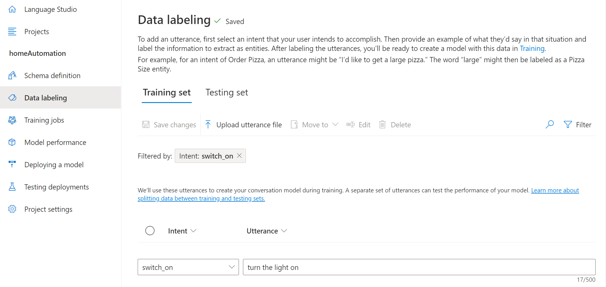
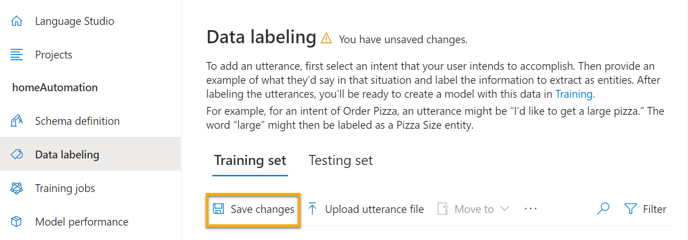
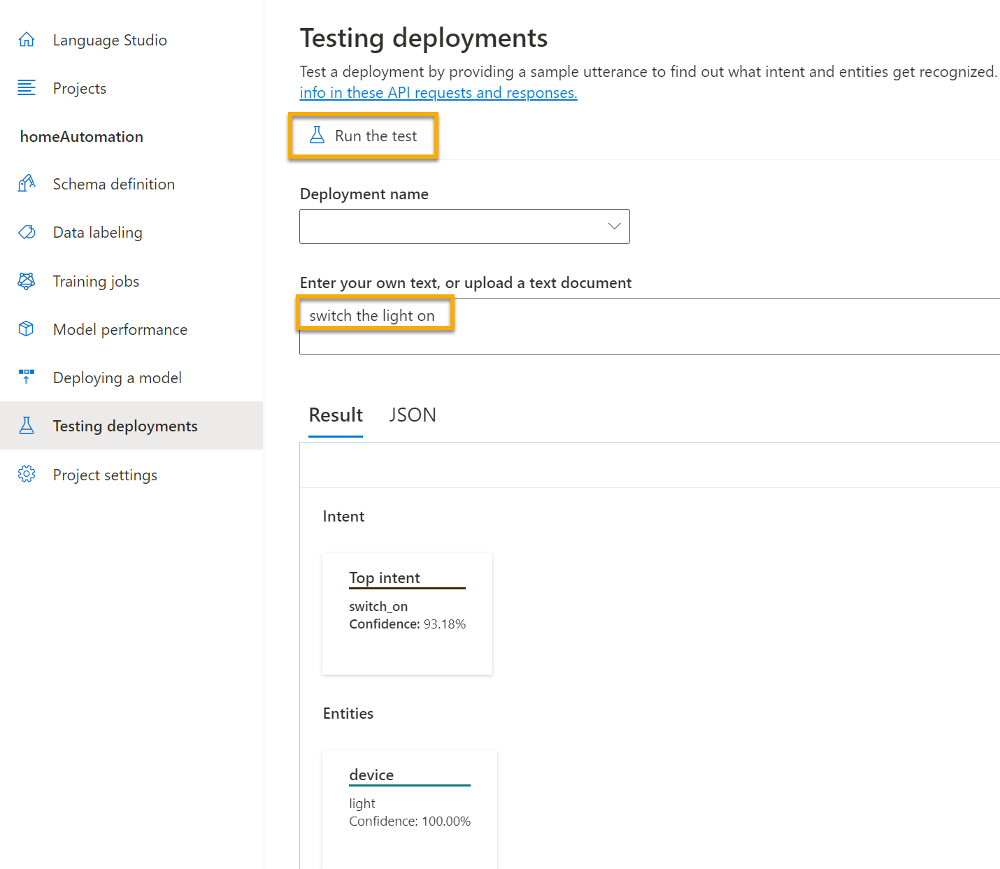

---
lab:
  title: Utiliser la compréhension du langage courant avec Language Studio
---

# Utiliser la compréhension du langage courant avec Language Studio

Nous attendons de plus en plus des ordinateurs qu’ils soient capables d’utiliser l’IA pour comprendre des commandes, orales ou écrites, en langage naturel. Par exemple, vous souhaiterez peut-être avoir un système domotique qui vous permet de contrôler les appareils de votre maison à l’aide de commandes vocales telles que « allume la lumière » ou « mets le ventilateur en marche ». Les appareils avec IA peuvent comprendre ces commandes et prendre les mesures appropriées.

Dans cet exercice, vous allez utiliser Language Studio pour créer et tester un projet qui envoie des instructions à des appareils tels que des lampes ou des ventilateurs. Vous utiliserez les fonctionnalités du service de compréhension du langage courant (CLU, Conversational Language Understanding) pour configurer votre projet. 

## Créer une ressource *Langage*

Vous pouvez utiliser de nombreuses fonctionnalités d’Azure AI Language avec une ressource **Language** ou **Azure AI services**. Dans certains cas, seule une ressource Language peut être utilisée. Pour l’exercice ci-dessous, nous allons utiliser une ressource **Language**. Si ce n’est déjà fait, créez une ressource **Langage** dans votre abonnement Azure.

1. Sous un nouvel onglet de navigateur, ouvrez le Portail Azure à l’adresse [https://portal.azure.com](https://portal.azure.com?azure-portal=true) et connectez-vous avec le compte Microsoft associé à votre abonnement Azure.

1. Cliquez sur le bouton **&#65291;Créer une ressource** et recherchez le *service Language*. Sélectionnez **créer** un plan du **service Language**. Vous êtes redirigé vers une page pour *sélectionner des fonctionnalités supplémentaires**. Conservez la sélection par défaut, puis cliquez sur **Continuer pour créer votre ressource**. 

1. Dans la page **Créer un langage**, configurez-la avec les paramètres suivants :
    - **Abonnement** : *votre abonnement Azure*.
    - **Groupe de ressources** : *sélectionnez ou créez un groupe de ressources portant un nom unique*.
    - **Région** : *Sélectionnez la région géographique la plus proche. Si vous êtes dans l’est des États-Unis, utilisez « USA Est 2 »*.
    - **Nom** : *entrez un nom unique.*
    - **Niveau tarifaire** : *Gratuit F0 ou S si Gratuit F0 n’est pas disponible*.
    - **En cochant cette case, je reconnais avoir lu et compris toutes les conditions ci-dessous** : *case cochée*.

1. Sélectionnez **Vérifier + créer**, puis **Créer** et attendez la fin du déploiement.

### Créer une application Conversational Language Understanding

Pour implémenter la compréhension du langage naturel avec Conversational Language Understanding, vous créez une application, puis ajoutez des entités, des intentions et des énoncés afin de définir les commandes que l’application doit exécuter.

1. Sous un nouvel onglet de navigateur, ouvrez le portail Language Studio sur [https://language.azure.com](https://language.azure.com?azure-portal=true) et connectez-vous avec le compte Microsoft associé à votre abonnement Azure.

1. Si vous êtes invité à choisir une ressource de langue, sélectionnez les paramètres suivants :
    - **Annuaire Azure** : *L’annuaire Azure contenant votre abonnement*.
    - **Abonnement Azure** : *Votre abonnement Azure*.
    - **Ressource Language** : *La ressource Language que vous avez créée précédemment*.

   Si vous n’êtes ***pas*** invité à choisir une ressource de langue, c’est peut-être parce que vous avez plusieurs ressources de langue dans votre abonnement, auquel cas :
    1. Dans la barre située en haut si la page, sélectionnez **Paramètres (&#9881;)**.
    2. Dans la page **Paramètres**, affichez l’onglet **Ressources**.
    3. Sélectionnez la ressource de langage que vous venez de créer, puis cliquez sur **Changer de ressource**.
    4. En haut de la page, sélectionnez **Language Studio** pour revenir à la page d’accueil de Language Studio.

1. En haut du portail, dans le menu **Créer**, sélectionnez **Conversational Language Understanding**.

1. Dans la boîte de dialogue **Créer un projet**, dans la page **Entrer les informations de base**, entrez les détails suivants, puis sélectionnez **Suivant** :
    - **Nom** : *Créer un nom unique*
    - **Langage principal des énoncés** : *Anglais*
    - **Activer plusieurs langues dans le projet** : *Ne pas sélectionner*
    - **Description** : `Simple home automation`

    > **Conseil** : notez le *nom de votre projet*, car vous l’utiliserez plus tard.

1. Sur la page **Vérifier et terminer**, sélectionnez **Créer**.

### Créer des intentions, des énoncés et des entités

Une *intention* est une action que vous souhaitez effectuer. Par exemple, vous pouvez souhaiter allumer une lumière ou éteindre un ventilateur. Dans ce cas, vous allez définir deux intentions : l’une pour allumer un appareil, et l’autre pour éteindre un appareil. Pour chaque intention, vous allez spécifier des exemples d’*énoncés* indiquant le type de langage utilisé pour marquer l’intention.

1. Dans le volet **Définition du schéma**, vérifiez que l’option **Intentions** est sélectionnée. Sélectionnez ensuite **Ajouter**, ajoutez une intention nommée `switch_on` (en minuscules), puis cliquez sur **Ajouter une intention**.

    

    

1. Sélectionnez l’intention **switch_on**. Vous accédez à la page **Étiquetage des données**. Dans la liste déroulante **Intention**, sélectionnez **switch_on**. À côté de l’intention **switch_on**, tapez l’énoncé `turn the light on`, puis appuyez sur **Entrée** pour le soumettre à la liste.

    

1. Le service Language a besoin d’au moins cinq exemples d’énoncés différents pour chaque intention afin d’entraîner suffisamment le modèle de langage. Ajoutez cinq autres exemples d’énoncés pour l’intention **switch_on** :  
    - `switch on the fan`
    - `put the fan on`
    - `put the light on`
    - `switch on the light`
    - `turn the fan on`

1. Dans le volet **Étiquetage d’entités pour l’entraînement** sur le côté droit de l’écran, sélectionnez **Étiquettes**, puis sélectionnez **Ajouter une entité**. Tapez `device` (en minuscules), sélectionnez **Liste**, puis sélectionnez **Ajouter une entité**.

    

    

1. Dans l’énoncé ***allumer le ventilateur***, surlignez le mot « ventilateur ». Ensuite, dans la liste qui s’affiche, dans la zone *Rechercher une entité*, sélectionnez **device**.

    

1. Faites de même pour tous les énoncés. Étiquetez le reste des énoncés *ventilateur* ou *lumière* avec l’entité **appareil**. Une fois que vous avez fini, vérifiez que vous disposez des énoncés suivants, puis sélectionnez **Enregistrer les changements** :

    | **intention** | **énoncé** | **entité** |
    | --------------- | ------------------ | ------------------ |
    | switch_on   | Mettre le ventilateur en marche      | Appareil - *sélectionner le ventilateur* |
    | switch_on   | Allumer la lumière    | Appareil - *sélectionner la lumière* |
    | switch_on   | Allumer la lumière | Appareil - *sélectionner la lumière* |
    | switch_on   | Allumer le ventilateur     | Appareil - *sélectionner le ventilateur* |
    | switch_on   | Mettre en route le ventilateur   | Appareil - *sélectionner le ventilateur* |
    | switch_on   | Allumer la lumière   | Appareil - *sélectionner la lumière* |

     

1. Dans le volet de gauche, sélectionnez **Définition du schéma** et vérifiez que votre intention **switch_on** est listée. Sélectionnez ensuite **Ajouter** et ajoutez une nouvelle intention avec le nom `switch_off` (en minuscules).

     

1. Sélectionnez l’intention **switch_off**. Vous accédez à la page **Étiquetage des données**. Dans la liste déroulante **Intention**, sélectionnez **switch_off**. À côté de l’intention **switch_off**, ajoutez l’énoncé `turn the light off`.

1. Ajoutez cinq autres exemples d’énoncés à l’intention **switch_off**.
    - `switch off the fan`
    - `put the fan off`
    - `put the light off`
    - `turn off the light`
    - `switch the fan off`

1. Étiquetez les mots *lumière* ou *ventilateur* avec l’entité **appareil**. Une fois que vous avez fini, vérifiez que vous disposez des énoncés suivants, puis sélectionnez **Enregistrer les changements** :  

    | **intention** | **énoncé** | **entité** | 
    | --------------- | ------------------ | ------------------ |
    | switch_off   | Arrêter le ventilateur    | Appareil - *sélectionner le ventilateur* | 
    | switch_off   | Couper la lumière  | Appareil - *sélectionner la lumière* |
    | switch_off   | Éteindre la lumière | Appareil - *sélectionner la lumière* |
    | switch_off   | Couper le ventilateur | Appareil - *sélectionner le ventilateur* |
    | switch_off   | Désactiver le ventilateur | Appareil - *sélectionner le ventilateur* |
    | switch_off   | Éteindre la lumière | Appareil - *sélectionner la lumière* |

### Effectuer l’apprentissage du modèle

Vous êtes maintenant prêt à utiliser les intentions et entités que vous avez définies afin d’effectuer l’apprentissage du modèle de langage conversationnel pour votre application.

1. Dans la partie gauche de Language Studio, sélectionnez **Tâches d’entraînement**, puis **Démarrer un travail d’entraînement**. Utilisez les paramètres suivants :
    - **Former un nouveau modèle** : *Sélectionnez et choisissez un nom de modèle*
    - **Mode d’entraînement** : Entraînement standard (gratuit)
    - **Division des données** : *sélectionnez Séparer automatiquement le jeu de test des données d’entraînement, conservez les pourcentages par défaut*
    - Sélectionnez **Entraîner** au bas de la page.

1. Attendez la fin de l’entraînement.

### Déployer et tester le modèle

Pour utiliser votre modèle entraîné dans une application cliente, vous devez le déployer en tant que point de terminaison auquel les applications clientes peuvent envoyer de nouveaux énoncés à partir desquels les intentions et les entités seront prédites.

1. Dans la partie gauche de Language Studio, sélectionnez **Déploiement d’un modèle**.

1. Sélectionnez le nom de votre modèle, puis sélectionnez **Ajouter un déploiement**. Utilisez les paramètres suivants :
    - **Créer ou sélectionner un nom de déploiement existant** : *sélectionnez Créer un nom de déploiement. Ajoutez un nom unique*.
    - **Attribuer un modèle entraîné à votre nom de déploiement** : *sélectionnez le nom du modèle entraîné*.
    - Sélectionnez **Déployer**

    > **Conseil** : notez le *nom de votre déploiement*, car vous l’utiliserez plus tard. 

1. Une fois le modèle déployé, sélectionnez **Test des déploiements** dans la partie gauche de la page, puis sélectionnez votre modèle déployé sous **Nom du déploiement**.

1. Entrez le texte suivant, puis sélectionnez **Exécuter le test** :

    `switch the light on`

     

    Passez en revue le résultat retourné, en notant qu’il inclut l’intention prédite (qui doit être **switch_on**) et l’entité prédite (**appareil**) avec des scores de confiance qui indiquent la probabilité calculée par le modèle pour l’intention et l’entité prédites. L’onglet JSON montre la confiance comparative pour chaque intention potentielle (celle qui a le score de confiance le plus élevé est l’intention prédite)

1. Effacez la zone de texte, puis testez le modèle avec les énoncés suivants sous *Entrez votre propre texte ou chargez un document texte* :
    - `turn off the fan`
    - `put the light on`
    - `put the fan off`

Vous avez réussi à configurer un projet de langage courant et à définir des entités, des intentions et des énoncés. Vous avez vu comment effectuer l’apprentissage d’un modèle et comment le déployer dans Language Studio. Vous l’avez essayé avec les deux énoncés que vous avez définis et avec d’autres que vous n’avez pas explicitement définis, mais que le modèle a pu déterminer.

> **REMARQUE** : la compréhension du langage courant fournit l’intelligence pour interpréter l’intention de l’entrée. Toutefois, elle n’effectue aucune action comme allumer la lumière ou le ventilateur. Un développeur doit créer une application qui utilise le modèle de compréhension du langage courant pour déterminer l’intention de l’utilisateur, puis automatiser l’action appropriée.

## Nettoyage

Si vous n’avez pas l’intention d’effectuer plus d’exercices, supprimez les ressources dont vous n’avez plus besoin. Cela évite d’accumuler des coûts inutiles.

1. Ouvrez le [Portail Azure]( https://portal.azure.com) et sélectionnez le groupe de ressources qui contient la ressource que vous avez créée. 1. Sélectionnez la ressource et choisissez **Supprimer**, puis **Oui** pour confirmer. La ressource est alors supprimée.

## En savoir plus

Cette application montre uniquement certaines des capacités de la fonctionnalité Conversational Language Understanding du service Language. Pour en savoir plus sur ce que ce service est capable de faire, consultez la [page Conversational Language Understanding](https://docs.microsoft.com/azure/cognitive-services/language-service/conversational-language-understanding/overview).
