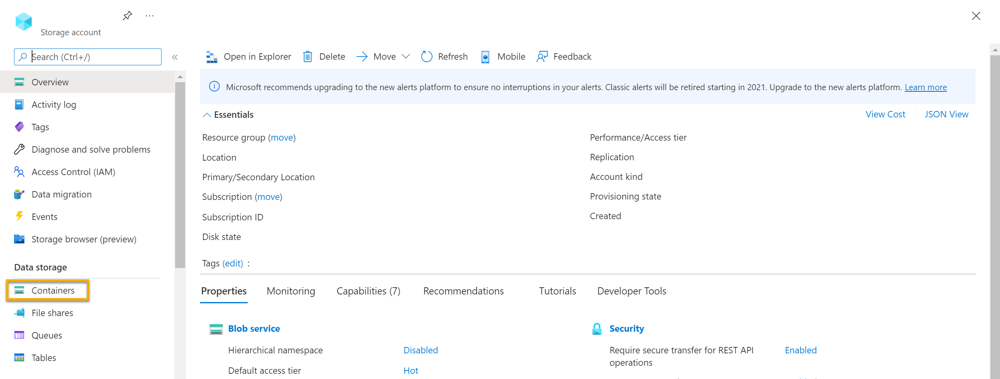
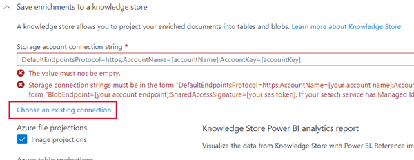
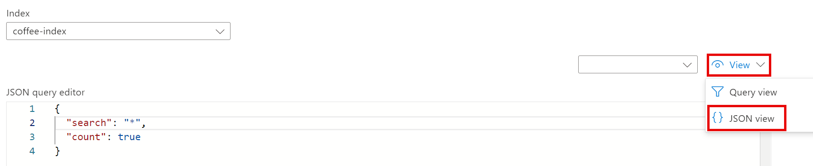

---
lab:
  title: Explorer un index de la Recherche Azure AI (interface utilisateur)
---

# Explorer un index de la Recherche Azure AI (interface utilisateur)

Supposons que vous travaillez pour Fourth Coffee, une chaîne de cafés nationale. Il vous est demandé de créer une solution d’exploration des connaissances qui facilitera la recherche d’insights sur les expériences des clients. Vous décidez de créer un index Recherche Azure AI en utilisant des données extraites des avis des clients.  

Dans ce labo, vous allez :

- Créer des ressources Azure
- Extraire des données d’une source de données
- Enrichir les données avec des compétences IA
- Utiliser l’indexeur d’Azure dans le portail Azure
- Interroger votre index de recherche
- Consulter les résultats enregistrés dans une base de connaissances

## Ressources Azure nécessaires

La solution que vous allez créer pour Fourth Coffee nécessite les ressources suivantes dans votre abonnement Azure :

- Une ressource **Recherche Azure AI**, qui va gérer l’indexation et l’interrogation.
- Une ressource **Azure AI services**, qui fournit les services d’IA pour les compétences que votre solution de recherche peut utiliser pour enrichir les données de la source de données avec des insights générés par l’IA.

    > **Remarque** Vos ressources Recherche Azure AI et Azure AI services doivent se trouver au même endroit.

- Un **compte de stockage** avec des conteneurs de blobs, qui stockent des documents bruts et autres collections de tables, d’objets ou de fichiers.

### Créer une ressource *Recherche Azure AI*

1. Connectez-vous au [portail Azure](https://portal.azure.com/learn.docs.microsoft.com?azure-portal=true).

1. Cliquez sur le bouton **+ Créer une ressource**, recherchez *Recherche Azure AI*, puis créez une ressource **Recherche Azure AI** avec les paramètres suivants :

    - **Abonnement** : *votre abonnement Azure*.
    - **Groupe de ressources** : *sélectionnez ou créez un groupe de ressources portant un nom unique*.
    - **Nom du service** : *nom unique*.
    - **Localisation** : *choisissez une région disponible*.
    - **Niveau tarifaire** : De base

1. Sélectionnez **Vérifier + créer**, et une fois la réponse **Validation effectuée** reçue, sélectionnez **Créer**.

1. Une fois le déploiement terminé, sélectionnez **Accéder à la ressource**. Dans la page de présentation de Recherche Azure AI, vous pouvez ajouter des index, importer des données et effectuer des recherches dans les index créés.

### Créer une ressource Azure AI services

Vous devez approvisionner une ressource **Azure AI services** qui se trouve au même endroit que votre ressource Recherche Azure AI. Votre solution de recherche va utiliser cette ressource pour enrichir les données dans le magasin de données avec des insights générés par IA.

1. Revenez à la page d’accueil du portail Azure. Cliquez sur le bouton **&#65291;Créer une ressource** et recherchez *Azure AI Services*. Sélectionnez **créer** un plan **Azure AI services**. Vous accédez à une page pour créer une ressource Azure AI services. Configurez-la avec les paramètres suivants :
    - **Abonnement** : *votre abonnement Azure*.
    - **Groupe de ressources** : *le même groupe de ressources que votre ressource Recherche Azure AI*.
    - **Région** : *la même localisation que votre ressource Recherche Azure AI*.
    - **Nom** : *nom unique*.
    - **Niveau tarifaire** : Standard S0
    - **En cochant cette case, j’ai reconnu que j’ai lu et compris tous les termes ci-dessous** : sélectionné

1. Sélectionnez **Revoir + créer**. Une fois que vous voyez la réponse **Validation réussie**, sélectionnez **Créer**.

1. Attendez la fin du déploiement, puis visualisez les détails du déploiement.

### Créez un compte de stockage.

1. Revenez à la page d’accueil du portail Azure, puis sélectionnez le bouton **+ Créer une ressource**.

1. Recherchez *compte de stockage*, puis créez une ressource de **Compte de stockage** avec les paramètres suivants :
    - **Abonnement** : *votre abonnement Azure*.
    - **Groupe de ressources** : *le même groupe de ressources que vos ressources Recherche Azure AI et Azure AI services*.
    - **Nom du compte de stockage** : *nom unique*.
    - **Localisation** : *choisissez une localisation disponible*.
    - **Performances** : standard
    - **Redondance** : stockage localement redondant (LRS)

1. Cliquez sur **Vérifier**, puis sur **Créer**. Attendez la fin du déploiement, puis accédez à la ressource déployée.

1. Dans le compte de stockage Azure créé, dans le volet du menu de gauche, sélectionnez **Configuration** (sous **Paramètres**).
1. Modifiez le paramètre *Autoriser l’accès anonyme aux objets blob* en **Activé**, puis sélectionnez **Enregistrer**.

## Charger des documents sur Stockage Azure

1. Dans le volet du menu de gauche, sélectionnez **Conteneurs**.

    

1. Sélectionnez **+ Conteneur**. Un volet s’ouvre à droite.

1. Entrez les paramètres suivants, puis cliquez sur **Créer** :
    - **Nom** : coffee-reviews  
    - **Niveau d’accès public** : Conteneur (accès en lecture anonyme pour les conteneurs et les objets blob)
    - **Avancé** : *aucun changement*.

1. Sous un nouvel onglet de navigateur, téléchargez le [fichier compressé d’avis sur le café](https://aka.ms/mslearn-coffee-reviews) à partir de `https://aka.ms/mslearn-coffee-reviews`, puis extrayez les fichiers dans le dossier *reviews*.

1. Dans le portail Azure, sélectionnez votre conteneur *coffee-reviews*. Dans le conteneur, sélectionnez **Charger**.

    

1. Dans le volet **Charger l’objet blob**, choisissez **Sélectionner un fichier**.

1. Dans la fenêtre de l’explorateur, sélectionnez **tous** les fichiers dans le dossier *reviews*, puis **Ouvrir** et **Charger**.

    

1. Une fois le chargement terminé, vous pouvez fermer le volet **Charger l’objet blob**. Vos documents se trouvent maintenant dans votre conteneur de stockage *coffee-reviews*.

## Indexer les documents

Une fois les documents dans le stockage, vous pouvez utiliser Recherche Azure AI pour extraire des insights à partir des documents. Le portail Azure fournit un *assistant Importer des données*. Avec cet assistant, vous pouvez créer automatiquement un index et un indexeur pour les sources de données prises en charge. Vous allez utiliser l’Assistant pour créer un index et importer vos documents de recherche à partir du stockage dans l’index de Recherche Azure AI.

1. Dans le Portail Azure, accédez à votre ressource Recherche Azure AI. Sur la page **Vue d’ensemble**, sélectionnez **Importer des données**.

    

1. Dans la page **Se connecter à vos données**, dans la liste **Source de données**, sélectionnez **Stockage Blob Azure**. Renseignez les détails du magasin de données avec les valeurs suivantes :
    - **Source de données** : Stockage Blob Azure
    - **Nom de la source de données** : coffee-customer-data
    - **Données à extraire** : Contenu et métadonnées
    - **Mode d’analyse** : Par défaut
    - **Chaîne de connexion** : *Sélectionnez **Choisir une connexion existante**. Sélectionnez votre compte de stockage, puis le conteneur **coffee-review**, et cliquez sur **Sélectionner**.
    - **Authentification d’identité managée** : Aucun
    - **Nom du conteneur** : *ce paramètre est renseigné automatiquement une fois que vous avez choisi une connexion existante*.
    - **Dossier d’objets blob** : *laissez ce champ vide*.
    - **Description** : Reviews for Fourth Coffee shops.

1. Sélectionnez **Suivant : Ajouter des compétences cognitives (facultatif)**.

1. Dans la section **Attacher Cognitive Services**, sélectionnez votre ressource Azure AI services.  

1. Dans la section **Ajouter des enrichissements** :
    - Remplacez le **Nom de l’ensemble de compétences** par **coffee-skillset**.
    - Cochez la case **Activer la reconnaissance optique de caractères et fusionner tout le texte dans le champ merged_content**.
        > **Remarque** Il est important de sélectionner **Activer l’OCR** pour voir toutes les options de champs enrichis.
    - Vérifiez que le **champ Données sources** est défini sur **merged_content**.
    - Changez le **niveau de précision d’enrichissement** en **Pages (segments de 5 000 caractères)**.
    - Ne pas sélectionner *Activer l’enrichissement incrémentiel*
    - Sélectionnez les champs enrichis suivants :

        | Compétence cognitive | Paramètre | Nom du champ |
        | --------------- | ---------- | ---------- |
        | Extraire les noms d’emplacement | | locations |
        | Extraire les phrases clés | | keyphrases |
        | Détecter les sentiments | | sentiment |
        | Générer les balises des images | | imageTags |
        | Générer les légendes des images | | imageCaption |

1. Sous **Enregistrer les enrichissements dans une base de connaissances**, sélectionnez :
    - Projections d’image
    - Documents
    - Pages
    - Expressions clés
    - Entities
    - Détails d’image
    - Références d’image

    > **Remarque** Si un message d’avertissement demandant une **chaîne de connexion de compte de stockage** s’affiche.
    >
    > 
    >
    > 1. Sélectionnez **Choisir une connexion existante**. Choisissez le compte de stockage que vous avez préalablement créé.
    > 1. Cliquez sur **+ Conteneur** pour créer un conteneur appelé **knowledge-store** avec un niveau de confidentialité **Privé**, puis sélectionnez **Créer**.
    > 1. Sélectionnez ensuite le conteneur **knowledge-store** et cliquez sur **Sélectionner** en bas de l’écran.

1. Sélectionnez **Projetions d’objets blob Azure : Document**. Un paramètre pour le *Nom du conteneur* avec le conteneur *knowledge-store* rempli automatiquement apparaît. Ne changez pas le nom du conteneur.

1. Sélectionnez **Suivant : Personnaliser l’index cible**. Remplacez le **Nom de l’index** par **coffee-index**.

1. Assurez-vous que la **Clé** est définie sur **metadata_storage_path**. Laissez **Nom du suggesteur** vide et **Mode de recherche** sur sa valeur pré-remplie.

1. Passez en revue les paramètres par défaut des champs de l’index. Sélectionnez **filtrable** pour tous les champs qui sont déjà sélectionnés par défaut.

    

1. Sélectionnez **Suivant : Créer un indexeur**.

1. Remplacez le **Nom de l’indexeur** par **coffee-indexer**.

1. Laissez la **Planification** définie sur **Une fois**.

1. Développez les **Options avancées**. Assurez-vous que l’option **Encoder les clés en Base-64** est sélectionnée, car l’encodage de clés peut rendre l’index plus efficace.

1. Sélectionnez **Envoyer** pour créer la source de données, les compétences, l’index et l’indexeur. L’indexeur est exécuté automatiquement et exécute le pipeline d’indexation, qui :
    - Extrait les champs de métadonnées des documents et le contenu de la source de données.
    - Exécute l’ensemble de compétences de compétences cognitives pour générer des champs enrichis supplémentaires.
    - Mappe les champs extraits à l’index.

1. Dans la moitié inférieure de la page **Vue d’ensemble** de votre ressource Recherche Azure AI, sélectionnez l’onglet **Indexeurs**. Cet onglet présente l’indexeur **coffee-indexer** récemment créé. Attendez une minute, puis sélectionnez **&orarr;Actualiser** jusqu’à ce que l’**État** indique la réussite de l’opération.

1. Sélectionnez le nom de l’indexeur pour afficher plus de détails.

    

## Interrogation de l'index

Utilisez l’Explorateur de recherche pour écrire et tester les requêtes. L’Explorateur de recherche est un outil intégré au portail Azure qui vous offre un moyen simple de valider la qualité de votre index de recherche. Vous pouvez utiliser l’Explorateur de recherche pour écrire des requêtes et passer en revue les résultats au format JSON.

1. Dans la page **Vue d’ensemble** du service Recherche, sélectionnez *Explorateur de recherche* en haut de l’écran.

   

1. Notez que l’index sélectionné est l’index *coffee-index* que vous avez créé.

    

    Dans le champ **Chaîne de requête**, entrez `search=*&$count=true`, puis sélectionnez **Rechercher**. La requête de recherche retourne tous les documents dans l’index de recherche, y compris le nombre de tous les documents dans le champ **@odata.count**. L’index de recherche doit retourner un document JSON contenant les résultats de votre recherche.

    > **Remarque** Si le message **Pour effectuer une recherche dans le portail, autorisez l’origine du portail dans les paramètres de votre index CORS** s’affiche, sélectionnez **Autoriser le portail**, puis **Rechercher**.

1. À présent, filtrons par localisation. Entrez `search=locations:'Chicago'` dans le champ **Chaîne de requête**, puis sélectionnez **Rechercher**. La requête recherche dans tous les documents de l’index et filtre les avis sur la localisation Chicago.

1. À présent, filtrons par sentiment. Entrez `search=sentiment:'negative'` dans le champ **Chaîne de requête**, puis sélectionnez **Rechercher**. La requête recherche dans tous les documents de l’index et filtre les avis sur un sentiment négatif.

   > **Remarque** Vous pouvez constater que les résultats sont triés par `@search.score`. Ce score affecté par le moteur de recherche exprime le degré de correspondance des résultats par rapport à la requête exécutée.

1. Un des problèmes que nous pouvons souhaiter résoudre est pourquoi il peut y avoir certains avis. Jetons un coup d’œil aux expressions clés associées à l’avis négatif. Qu’est-ce qui selon vous pour être la cause de l’avis ?

## Passer en revue la base de connaissances

Voyons la puissance de la base de connaissances en action. Quand vous avez exécuté l’*Assistant Importation de données*, vous avez également créé une base de connaissances. À l’intérieur de la base de connaissances, vous allez trouver les données enrichies extraites par les compétences IA conservées sous forme de projections et de tables.

1. Dans le portail Azure, revenez à votre compte de stockage Azure.

1. Dans le volet du menu de gauche, sélectionnez **Conteneurs**. Sélectionnez le conteneur **knowledge-store**.

    

1. Sélectionnez un des éléments, puis cliquez sur le fichier **objectprojection.json**.

    

1. Sélectionnez **Modifier** pour voir le fichier JSON produit pour un des documents de votre magasin de données Azure.

    

1. Sélectionnez la barre de navigation de l’objet blob de stockage en haut à gauche de l’écran pour retourner au compte de stockage *Conteneurs*.

    

1. Dans *Conteneurs*, sélectionnez le conteneur *coffee-skillset-image-projection*. Sélectionnez un des éléments.

    

1. Sélectionnez un des fichiers *.jpg*. Sélectionnez **Modifier** pour voir l’image stockée provenant du document. Notez que toutes les images des documents sont stockées de cette manière.

    

1. Sélectionnez la barre de navigation de l’objet blob de stockage en haut à gauche de l’écran pour retourner au compte de stockage *Conteneurs*.

1. Sélectionnez **Navigateur de stockage** dans le panneau de gauche, puis sélectionnez **Tables**. Il existe une table pour chaque entité de l’index. Sélectionnez la table *coffeeSkillsetKeyPhrases*.

    Examinez les expressions que la base de connaissances a pu capturer à partir du contenu des avis. La plupart des champs sont des clés, ce qui vous permet de lier les tables comme une base de données relationnelle. Le dernier champ affiche les phrases clés qui ont été extraites par l’ensemble de compétences.

## En savoir plus

Cet index de recherche simple n’est qu’une partie des fonctionnalités du service Recherche Azure AI. Pour en savoir plus sur ce que vous pouvez faire avec ce service, consultez la [page du service Recherche Azure AI](/azure/search/search-what-is-azure-search).
