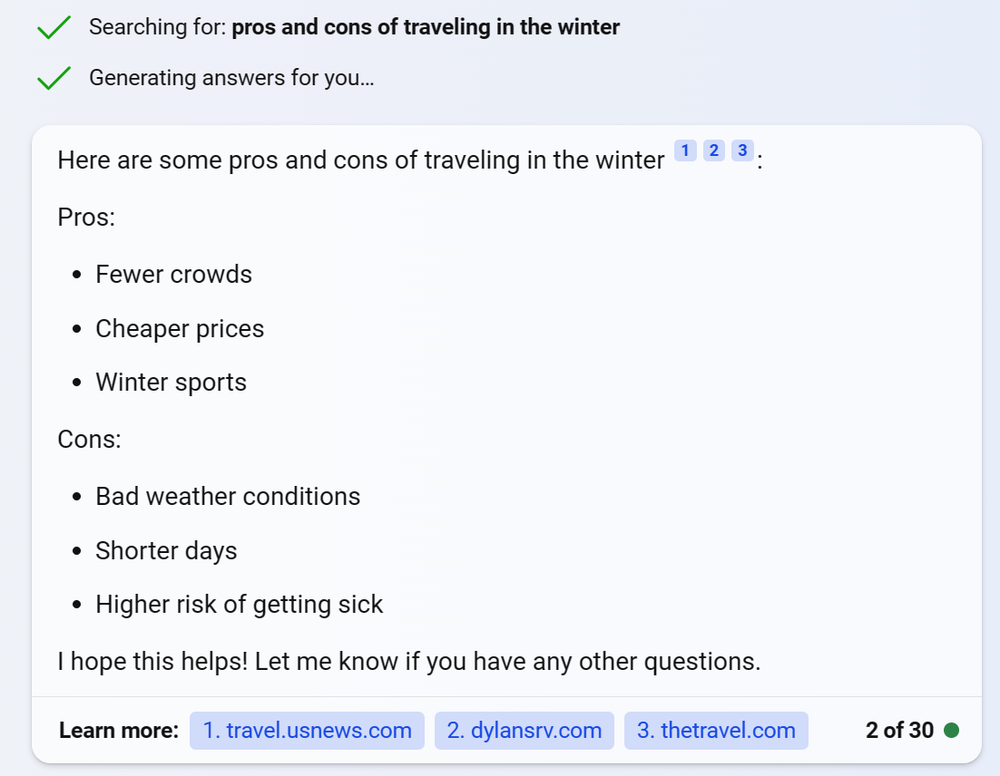
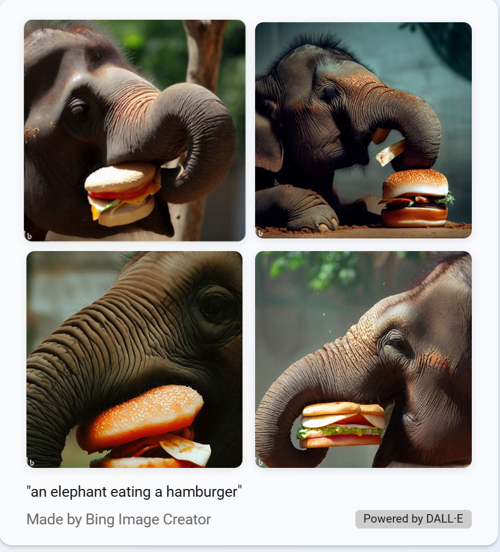

---
lab:
  title: Explorer l’IA générative avec Microsoft Copilot
---
# Explorer l’IA générative avec Microsoft Copilot

Dans cet exercice, vous allez explorer l’IA générative avec Microsoft Copilot. 

## Se connecter à Microsoft Copilot

1. Ouvrez [copilot.microsoft.com](https://copilot.microsoft.com?azure-portal=true) et connectez-vous avec votre compte Microsoft personnel.

1. Microsoft Copilot utilise l’IA générative pour améliorer les résultats de la recherche Bing. Cela signifie que contrairement à la recherche seule qui retourne du contenu existant, Microsoft Copilot peut élaborer de nouvelles réponses basées sur la modélisation du langage naturel et les informations du web.  

1. Vers le bas de l’écran, vous verrez une fenêtre **Demandez-moi ce que vous voulez**. À mesure que vous entrez des invites dans la fenêtre, Copilot utilise l’intégralité du thread de conversation pour retourner des réponses. Par exemple, essayons de poser une série de questions sur les voyages.

## Utiliser des demandes pour générer des réponses

1. Entrez une demande : `What are 3 pros and cons of traveling in the winter?`. Vous verrez les éléments *Recherche de :...* et *Génération en cours...* s’afficher avant la réponse. Le modèle utilise les réponses recherchées comme informations de base pour générer des réponses originales. Notez que la fin de la réponse contient des liens vers ses sources. 

 

> **Remarque** : si vous ne voyez pas le message **Génération en cours...* ou une liste à puces de réponses, vous n’avez pas encore vu Copilot en action. Vous devez revenir au menu de connexion et connecter le compte actuel que vous utilisez avec un compte personnel. 
 
1. Entrez une demande : `Find me 3 more pros`. En faisant cette demande, vous aimeriez voir 3 raisons plus positives de voyager en hiver qui n’ont pas déjà été répertoriées. Notez qu’avec cette invite, vous demandez à Copilot d’effectuer deux actions que la recherche seule ne fait pas : utiliser la réponse de la conversation précédente pour exclure ce qui est retourné dans la nouvelle réponse et utiliser la rubrique de la conversation précédente sans la mentionner explicitement. 

1. Entrez une demande : `Where are 3 places I can go to find fewer crowds?`. 

    > **Remarque** : notez que même si Copilot peut donner une réponse associée, il peut supprimer des « souvenirs » antérieurs du fil de conversation à mesure qu’il continue. Par conséquent, les réponses que vous obtenez peuvent ne pas être directement liées aux voyages en hiver. Cela relève en grande partie des limitations d’entrées de jeton. La conversation se « souvient » d’éléments antérieurs d’une conversation parce qu’elle a enregistré une certaine quantité de jetons de la conversation. À mesure que de nouveaux jetons sont introduits avec de nouvelles demandes et réponses, la conversation délaissera les jetons plus anciens. 

1. Le bouton **Nouvelle rubrique** à côté de la fenêtre de conversation est utile. Cliquez dessus pour effacer le fil de conversation précédent afin que les réponses générées pour une nouvelle rubrique ne soient pas basées sur la rubrique précédente. Utilisez l’icône **Nouveau sujet** en regard de la fenêtre de conversation pour effacer l’historique des conversations. 

## Essayer la génération d’images

1. Voyons maintenant un exemple de génération d’images. Entrez une demande : `Create an image of an elephant eating a hamburger`. Un message *Je vais essayer de créer ça...* s’affiche avant que Copilot retourne une réponse. 

    

    Notez que la réponse peut être similaire, mais pas la même. Cela est dû au fait que les réponses sont variées.  

1. Dans la réponse, un texte en bas indique « Optimisé par DALL-E ». Considérez que DALL-E est basé sur de nombreux modèles de langage, car votre entrée en langage naturel génère des images. 

1. Revenez à la conversation de Copilot en cliquant sur l’icône Microsoft Bing dans le coin supérieur droit de l’écran. 

## Essayer une génération de code

1. Voyons maintenant un exemple de génération et de traduction de code. Entrez une demande : `Use Python to create a list`. 

1. Entrez la demande : `Translate that into C#`. Notez que vous n’avez pas besoin de spécifier la nature de « ça », car Copilot sait se référer à l’historique des conversations.

## Tâche bonus

1. Entrez une demande : `What are 3 examples of generative AI helping people?`. Servez-vous-en pour réfléchir à vos propres idées de copilote !  
