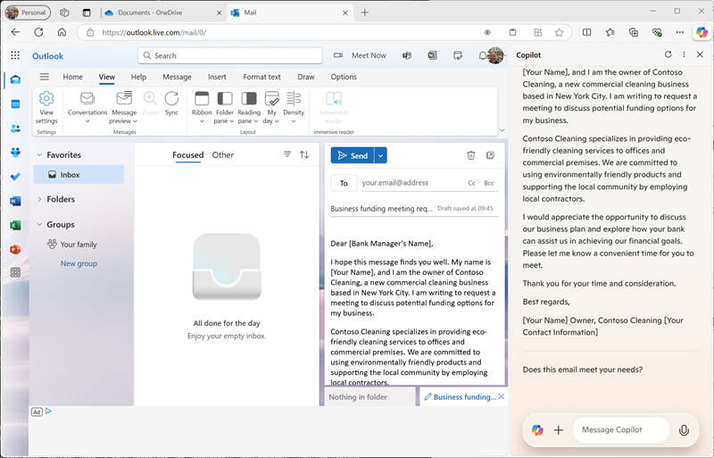

---
lab:
  title: Découvrir Copilot dans Microsoft Edge
---
# Découvrir Microsoft Copilot dans Microsoft Edge

Dans cet exercice, vous allez découvrir quelques-unes des façons dont Microsoft Copilot peut utiliser l’IA générative pour améliorer votre productivité lors de la création de contenu. Dans le scénario de cet exercice, vous allez commencer par quelques notes générales pour trouver une idée d’entreprise, puis vous utiliserez Copilot dans Microsoft Edge pour vous aider à développer un plan d’entreprise et une présentation pour de investisseurs potentiels.

Cet exercice devrait prendre environ **40** minutes.

> **Remarque** : Cet exercice suppose que vous disposez d’un [compte Microsoft personnel](https://signup.live.com) (tel qu’un compte outlook.com) avec lequel vous êtes connecté à [Microsoft Edge](https://www.microsoft.com/edge/download) sur votre ordinateur.

## Utiliser Copilot pour explorer un document et rechercher une idée

Pour démarrer votre exploration de l’IA générative, vous allez utiliser Microsoft Copilot dans Edge pour examiner un document existant et en extraire des insights.

1. Dans Microsoft Edge, accédez à [OneDrive](https://onedrive.live.com) à l’adresse `https://onedrive.live.com` et connectez-vous à l’aide de votre compte Microsoft personnel, en fermant tout message de bienvenue ou toute offre affichée.
1. Dans un autre onglet du navigateur web, ouvrez le document [Business Idea.docx](https://github.com/MicrosoftLearning/mslearn-ai-fundamentals/raw/main/data/generative-ai/Business%20Idea.docx) depuis l’emplacement `https://github.com/MicrosoftLearning/mslearn-ai-fundamentals/raw/main/data/generative-ai/Business%20Idea.docx`. Lorsque le document s’ouvre dans Edge, sélectionnez ensuite l’option permettant d’**Enregistrer une copie dans OneDrive** et enregistrer le document dans votre dossier **Documents** de OneDrive. Le document doit ensuite s’ouvrir automatiquement dans Microsoft Word online.

    > **Conseil** : Si l’option permettant d’enregistrer une copie du fichier sur OneDrive ne s’affiche pas, téléchargez-le sur votre ordinateur local. Ensuite, dans OneDrive, ouvrez le dossier **Documents** et utilisez le bouton **+ Ajouter un nouveau** pour charger le fichier **Business Idea.docx** à partir de votre ordinateur local sur OneDrive.

1. Affichez le texte dans **Business Idea.docx** qui décrit quelques idées de haut niveau pour une entreprise de nettoyage dans la ville de New York.
1. Utilisez l’icône **Copilot** dans la barre d’outils Edge pour ouvrir le volet Copilot, comme illustré ici :

    

1. Dans le volet Copilot, faites défiler vers le bas pour afficher tout le contenu (si nécessaire) et assurez-vous de la sélection de l’onglet **Conversation**, mais également de la définition du style conversationnel sur **Plus équilibré**. Cela garantit que Copilot répond avec un équilibre entre créativité et précision factuelle.
1. Dans la zone de conversation au bas du volet Copilot, entrez le prompt suivant :

    ```
    What is this document about?
    ```

    Si vous y êtes invité, confirmez que vous souhaitez autoriser Copilot à accéder à la page.

1. Passez en revue la réponse de Copilot qui doit résumer les principaux points du document, tel qu’illustré ici :

    

    > **Remarque** : La réponse spécifique peut varier.

1. Entrez l’invite suivante :

    ```
    How do I go about setting up a business in New York?
    ```

1. Passez en revue la réponse. Elle doit contenir des conseils et des liens vers des ressources pour vous aider à mettre en place une entreprise à New York et peut inclure des prompts de suivi suggérées pour obtenir plus d’informations.

    > **Important** : La réponse générée par l’IA est basée sur des informations publiques sur le web. Bien que cette réponse puisse vous aider à comprendre les étapes nécessaires à la création d’une entreprise, son exactitude n’est pas garantie à 100 % et elle ne saurait remplacer l’avis d’un professionnel !

## Utiliser Copilot pour créer le contenu d’un plan d’entreprise

Après ces quelques recherches initiales effectuées, demandons à Copilot de vous aider à développer un plan d’entreprise pour votre entreprise de nettoyage.

1. Le document **Business Idea.docx** étant toujours ouvert dans Microsoft Edge, entrez le prompt suivant dans le volet Copilot :

    ```
    Suggest a name for my cleaning business
    ```

1. Passez en revue les suggestions et sélectionnez un nom pour votre entreprise de nettoyage (ou continuez à entrer des prompts pour trouver le nom de votre choix).
1. Entrez le prompt suivant, en remplaçant *Contoso Cleaning* par le nom de l’entreprise de votre choix :

    ```
    Write a business plan for "Contoso Cleaning" based on the information in this document. Include an executive summary, market overview, and financial projections.
    ```

1. Passez en revue la réponse et, sous la sortie, utilisez l’icône **Copier** (&#128461;) pour la copier dans le presse-papiers. Sélectionnez ensuite le texte complet du document **Business Ideas.docx** et remplacez-le par le texte copié. Enfin, placez le texte collé en remplaçant le texte initial dans la réponse (dans laquelle Copilot a reconnu l’instruction) par un titre pour le nom de votre entreprise de nettoyage. Vous devez vous retrouver avec un document du plan d’entreprise, semblable à cet exemple :

    

1. Dans le volet Copilot qui s’affiche, entrez le prompt suivant :

    ```
    Create a corporate logo for the cleaning company. The logo should be round and include an iconic New York landmark.
    ```

1. Passez en revue la réponse qui doit présenter quatre options pour un logo créé par Microsoft Designer.
1. Utilisez plus d’invites pour itérer sur la conception (par exemple `Make it green and blue`) jusqu’à ce que vous ayez un logo qui vous plaît.
1. Cliquez avec le bouton droit sur la conception du logo que vous préférez et copiez-la dans le presse-papiers. Collez-le ensuite en haut du document du plan d’entreprise, comme suit :

    

1. Fermez l’onglet Microsoft Word et revenez au dossier **Documents** dans votre espace OneDrive.

## Utiliser Copilot pour créer le contenu d’une présentation

Avec l’aide de Copilot, vous avez créé le brouillon d’un plan d’entreprise pour l’idée d’une société de nettoyage. Vous devez maintenant disposer d’une présentation efficace pour convaincre un investisseur de vous prêter le financement pour démarrer l’entreprise.

1. Dans le dossier **Documents**, dans OneDrive, ajoutez une nouvelle **présentation PowerPoint**.

    Si le volet **Concepteur** s’ouvre automatiquement, fermez-le.

1. Dans la diapositive du titre de la présentation, entrez le nom de votre entreprise de nettoyage comme titre, mais également `Investor Opportunity` comme sous-titre.
1. Ajoutez une nouvelle diapositive à l’aide de la disposition des diapositives **Deux contenus** (qui inclut un titre et deux espaces réservés au contenu).
1. Modifiez le titre de la diapositive en `Benefits of Hiring a Commercial Cleaner`.
1. Dans le volet Copilot qui s’affiche, entrez le prompt suivant :

    ```
    Write a summary of the benefits of using a corporate cleaning company for your business. The summary should consist of five short bullet points.
    ```

1. Copiez la réponse de Copilot dans le presse-papiers et collez-la dans l’espace réservé de contenu de gauche. Supprimez ensuite la phrase initiale qui reconnaît la requête et reformatez le texte dans l’espace réservé jusqu’à trouver satisfaction.
1. Dans le volet Copilot qui s’affiche, entrez le prompt suivant :

    ```
    Create a photorealistic image of a clean office.
    ```

1. Lorsque Copilot a généré une image qui vous plaît, copiez-la dans le presse-papiers et collez-la dans l’espace réservé de contenu à la droite de la diapositive.

    Si le volet **Concepteur** s’ouvre automatiquement, sélectionnez une conception de la diapositive que vous aimez. Fermez ensuite le volet **Concepteur**.

1. Appliquez tout reformatage supplémentaire que vous pensez être nécessaire jusqu’à ce que vous ayez une diapositive semblable à celle-ci :

    

1. Dans la barre de titre PowerPoint, sélectionnez le nom de la présentation par défaut (**Présentation**) et renommez-le en `Business Presentation.pptx`.
1. Fermez l’onglet PowerPoint et revenez au dossier **Documents** dans votre espace OneDrive.

## Utiliser Copilot pour rédiger un e-mail

Vous avez créé des documentations et ressources d’accompagnement pour vous aider à démarrer votre entreprise. Il est temps de prendre contact avec un investisseur pour obtenir un capital de démarrage.

1. Utilisez le **Lanceur d’applications** à gauche de la barre de titre OneDrive pour ouvrir **Outlook**.
1. Créez un e-mail et entrez votre propre adresse e-mail dans la zone **À**.
1. Dans le volet Copilot, sélectionnez l’onglet **Composer**. Définissez ensuite les options suivantes pour composer un nouveau contenu :
    - **Écrivez sur** : `Request a meeting with an investment bank to discuss funding for a commercial cleaning business.`
    - **Ton** : Professionnel
    - **Format**: E-mail
    - **Longueur** : Moyen
1. Sélectionnez **Générer un brouillon**, puis passez en revue la sortie générée.
1. Utilisez le contenu généré pour terminer votre e-mail, comme indiqué ici :

    

    Vous pouvez vous envoyer l’e-mail si vous le souhaitez !

## Défi

Vous venez de voir comment utiliser Copilot pour rechercher des idées et générer du contenu. Et si nous allions un peu plus loin ? Pour démarrer une nouvelle session Copilot, sous l’onglet **Conversation**, sélectionnez l’icône **Nouvelle rubrique** en regard de la zone d’invite, puis essayez d’utiliser Copilot afin de planifier un événement pour promouvoir l’alphabétisation des enfants dans une bibliothèque locale. Voici quelques éléments à essayer :

- Recherchez certains conseils pour encourager les enfants à lire dès leur plus jeune âge.
- Créez une affichette ou une affiche pour l’événement.
- Composez un e-mail pour une campagne afin d’inviter les auteurs pour enfants locaux à participer à l’événement et à y prendre la parole.
- Créez une présentation pour démarrer l’événement.

Soyez aussi inventif que vous le souhaitez et découvrez comment Copilot peut vous aider en trouvant des informations, en générant et en affinant du texte, en créant des images et en répondant à des questions.


## Conclusion

Dans cet exercice, vous avez utilisé Copilot dans Microsoft Edge pour trouver des informations et générer du contenu. Nous espérons que vous avez vu comment l’utilisation de l’IA générative dans un copilote peut améliorer la productivité et la créativité.

Bien que les services gratuits utilisés dans ces exercices soient sans aucun doute très puissants, vous pouvez obtenir encore plus avec des services tels que [Copilot pour Microsoft 365](https://www.microsoft.com/microsoft-365/enterprise/copilot-for-microsoft-365), dans lesquels Microsoft Copilot est intégré aux applications de productivité Windows et Microsoft Office, fournissant une aide hautement contextuelle avec des tâches courantes. Microsoft 365 vous permet d’apporter la puissance de l’IA générative à vos données et processus d’entreprise, tout en l’intégrant à votre infrastructure informatique existante pour garantir une solution gérable et sécurisée.