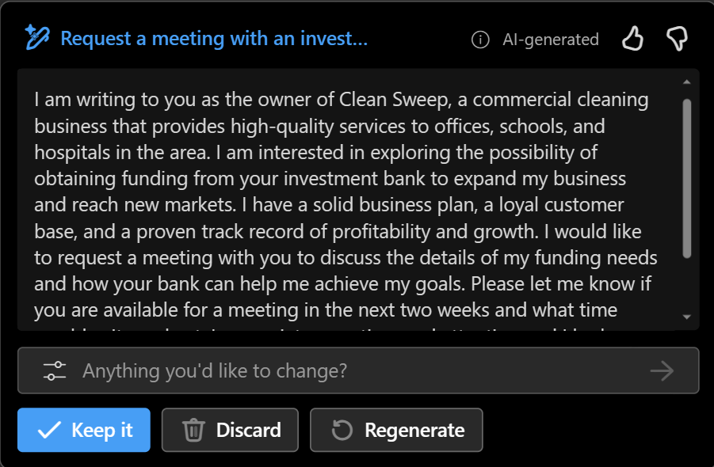

---
lab:
  title: Découvrir Copilot pour Microsoft 365
---
# Découvrir Copilot pour Microsoft 365

Dans cet exercice, vous allez découvrir quelques-unes des façons dont Microsoft Copilot peut utiliser l’IA générative pour améliorer votre productivité lors de la création de contenu. Dans le scénario de cet exercice, vous allez commencer par quelques notes générales pour trouver une idée d’entreprise, puis vous utiliserez Copilot pour Microsoft 365 dans plusieurs applications telles que Word, PowerPoint et Excel pour vous aider à développer un plan d’entreprise et une présentation pour des investisseurs potentiels.

Cet exercice devrait prendre environ **40** minutes.

> **Remarque** : pour effectuer cet exercice, vous devez obtenir une licence **Copilot pour Microsoft 365** auprès de votre organisation.

## Utiliser Copilot pour explorer un document et rechercher une idée

Pour démarrer votre exploration de l’IA générative, vous allez utiliser Copilot pour Word pour examiner un document existant et en extraire des insights.

1. Dans votre navigateur web, ouvrez le document [Business Idea.docx](https://github.com/MicrosoftLearning/mslearn-ai-fundamentals/raw/main/data/generative-ai/Business%20Idea.docx) à l’emplacement `https://github.com/MicrosoftLearning/mslearn-ai-fundamentals/raw/main/data/generative-ai/Business%20Idea.docx`. 
1. Sélectionnez **Télécharger** pour enregistrer le fichier dans le dossier **Téléchargements** de votre PC.
1. Sélectionnez **Déplacer** ou **Copier et coller** pour placer le document que vous venez de télécharger dans le dossier **OneDrive**.
1. Dans votre dossier **OneDrive**, ouvrez **Business Idea.docx** dans Microsoft Word (en fermant les messages de bienvenue ou les notifications de nouvelles fonctionnalités), puis passez en revue le document qui décrit quelques idées générales pour une entreprise de nettoyage à New York. Si vous y êtes invité, sélectionnez **Activer la modification** en haut.
1. Recherchez et sélectionnez l’icône **Copilot** dans la barre d’outils de Word pour ouvrir le volet Copilot, comme vous pouvez le voir ici (votre thème visuel peut varier) :

    

1. Dans le volet Copilot, entrez le prompt suivant dans la zone de texte en bas :

    ```
    What is this document about?
    ```

1. Passez en revue la réponse de Copilot qui doit résumer les principaux points du document. En voici un exemple :

    

    > La réponse spécifique que vous recevez peut varier en raison de la nature de l’IA générative.

1. Revenez au volet Copilot et posez à Copilot la question suivante :

    ```
    How do I setup a new business in New York?
    ```

1. Passez en revue la réponse et posez des questions supplémentaires si nécessaire. Quand la réponse vous convient, utilisez l’icône **Copier** (&#128461;) située sous la réponse pour la copier dans le Presse-papiers. Collez-la dans le document Word, sélectionnez tout le texte, puis sélectionnez l’icône Copilot (en bas du tex sélectionné) pour visualiser le texte sous forme de tableau.

    

1. Passez en revue le tableau et demandez à Copilot d’ajouter des informations supplémentaires telles que des références pour fournir plus de détails.  Votre réponse doit ressembler à ceci (vous devrez peut-être utiliser le bouton **Regénérer**) :

    

    > **Important** : la réponse générée par l’IA est basée sur des informations publiques sur le web. Bien que cette réponse puisse vous aider à comprendre les étapes nécessaires à la création d’une entreprise, son exactitude n’est pas garantie à 100 % et elle ne saurait remplacer l’avis d’un professionnel.

1. Quand le tableau généré par Copilot vous convient, sélectionnez l’option **Conserver**.

## Utiliser Copilot pour créer le contenu d’un plan d’entreprise

Après ces quelques recherches initiales, demandons à Copilot de vous aider à développer un plan d’entreprise pour votre entreprise de nettoyage.

1. Le document **Business Idea.docx** étant toujours ouvert, entrez le prompt suivant dans le volet Copilot :

    ```
    Can you suggest a name for my cleaning business?
    ```

1. Passez en revue les suggestions et sélectionnez un nom pour votre entreprise de nettoyage (ou continuez à entrer des prompts pour trouver le nom de votre choix).
1. Dans le document Word, sélectionnez l’icône Copilot dans la marge pour rédiger un nouveau contenu. Entrez le prompt suivant, en remplaçant **Contoso Cleaning** par le nom de l’entreprise de votre choix :

    ```
    Write a business plan for "Contoso Cleaning" based on the information in this document. Include an executive summary, market overview, and financial projections.
    ```

    

1. Passez en revue la réponse rédigée par Copilot, puis conservez-la, ajustez le ton et la longueur ou demandez à Copilot de la réécrire avec un nouveau prompt. Appliquez des titres et un style appropriés à votre document pour lui donner un aspect professionnel. Votre réponse doit ressembler à ceci :

    

1. Si les projections financières dans le plan d’entreprise ne sont pas présentées sous forme de tableau, sélectionnez-les et utilisez Copilot pour visualiser les projections sous forme de tableau.
1. Sélectionnez le tableau des projections financières et copiez-le dans le Presse-papiers.
1. Enregistrez le document Word, puis fermez-le.

## Visualiser les projections financières dans Copilot pour Excel

Plan d’entreprise en main, nous allons prendre une partie de ces données sur les projections financières et demander à Copilot dans Excel de créer une visualisation de ces données pour que nous puissions l’inclure dans des e-mails ou des présentations à des investisseurs.

1. Ouvrez **Excel** et créez un classeur vide. Enregistrez immédiatement le classeur sous le nom **Financial Projections.xlsx** sur OneDrive, autrement Copilot ne fonctionnera pas.
1. Collez le tableau de projection des ventes de **Business Idea.docx** dans la feuille de calcul Excel et **mettez-le sous forme de tableau**. Pour ce faire :
    1. Sélectionnez une **cellule** dans vos données.
    1. Sélectionnez **Accueil**, puis choisissez **Mettre sous forme de tableau** sous Styles. 
    1. Choisissez un style pour votre tableau.
    1. Dans la boîte de dialogue **Créer un tableau**, confirmez ou définissez votre plage de cellules.
    1. Indiquez si votre tableau comporte des en-têtes, puis sélectionnez **OK**.
1. Une fois vos projections de ventes mises sous forme de tableau, ouvrez le volet Copilot à partir de l’onglet **Accueil** du ruban Excel et entrez le prompt suivant :

    ```
    Suggest ways to visualize these financial projections.
    ```
    
1. Copilot doit vous suggérer une façon de visualiser vos données et vous proposer d’ajouter un graphique croisé dynamique à une nouvelle feuille.

    

1. Ajoutez le graphique croisé dynamique à une nouvelle feuille et ouvrez-le. Sélectionnez le graphique, puis **Créer** pour appliquer des styles, modifier le type de graphique et effectuer d’autres actions. À la fin, vous devriez avoir quelque chose qui ressemble à ceci :

    

1. Enregistrez le classeur et fermez Excel.

Vous venez d’utiliser des données créées à partir de Copilot dans Word pour les visualiser dans Excel. Dans l’exercice suivant, vous allez utiliser Copilot dans Outlook pour composer et envoyer des e-mails sur le travail que vous avez effectué.

## Utiliser Copilot pour composer un e-mail

Vous avez créé des documentations et ressources d’accompagnement pour vous aider à démarrer votre entreprise. Il est temps de prendre contact avec un investisseur pour obtenir un capital de démarrage.

1. Ouvrez **Outlook**. Si vous n’avez pas configuré Outlook avec votre compte Microsoft 365, faites-le.

    > **Conseil** : Consultez [Configurer et utiliser Outlook – Support Microsoft](https://support.microsoft.com/office/set-up-and-use-outlook-4636f361-d5e3-4a87-9cd4-382858de55fa) pour obtenir de l’aide avec cette procédure.

1. Dans la barre d’outils, basculez vers la **nouvelle expérience Outlook** si elle n’est pas déjà active.

    > **Remarque** : Pour obtenir les dernières fonctionnalités de Copilot dans Outlook, vous devez utiliser l’expérience « Nouvel Outlook ». Pour savoir la version que vous utilisez, consultez [Identifier votre version d’Outlook – Support Microsoft](https://support.microsoft.com/office/what-version-of-outlook-do-i-have-b3a9568c-edb5-42b9-9825-d48d82b2257c).

1. Créez un e-mail et entrez votre propre adresse e-mail dans la zone **À**.
1. Vous pouvez commencer à rédiger votre e-mail à partir du volet Copilot ou directement à partir du corps de l’e-mail :

    
    
1. Entrez le prompt suivant et ajustez les options afin de définir le ton sur « Formel » et la longueur sur « Moyenne » :

    ```
    Request a meeting with an investment bank to discuss funding for a commercial cleaning business.
    ```

    

1. Sélectionnez **Générer un brouillon**, puis passez en revue la sortie générée. Ajustez le ton ou indiquez à Copilot ce que vous souhaitez modifier dans l’e-mail.

    

1. Vous pouvez vous envoyer l’e-mail si vous le souhaitez.

## Utiliser Copilot pour créer le contenu d’une présentation

Avec l’aide de Copilot, vous avez créé un brouillon de plan d’entreprise pour l’entreprise de nettoyage, préparé certaines projections financières et envoyé un e-mail pour demander un entretien avec un investisseur potentiel. Vous avez maintenant besoin d’une présentation efficace pour communiquer les atouts de votre entreprise.

1. Ouvrez **PowerPoint** et créez une **présentation vide**. Si le volet **Concepteur** s’ouvre automatiquement, fermez-le.

    

1. Enregistrez la présentation sous le nom **Cleaning Company.pptx** dans votre dossier OneDrive.
1. Sélectionnez le **bouton Copilot** sous l’**onglet Accueil** du ruban, sélectionnez **Créer une présentation sur...**, puis complétez le prompt dans le volet Copilot comme ceci :

    ```
    Create a presentation about a corporate cleaning service in New York City.
    ```

1. Copilot génère des diapositives dans la présentation.  Le processus peut prendre plusieurs minutes et votre sortie doit ressembler à ceci avec un thème différent :

    

1. Sélectionnez l’avant-dernière diapositive de la présentation. Ensuite, dans le volet Copilot, utilisez le prompt **Ajouter une diapositive à propos de...** pour créer une diapositive à propos de `the benefits of an eco-friendly approach to cleaning.`

    

1. Enregistrez la présentation.

## Défi

Vous venez de voir comment utiliser Copilot pour Microsoft 365 dans quelques applications pour rechercher des idées et générer du contenu. Et si nous allions un peu plus loin ? Essayez d’utiliser Copilot pour planifier un événement visant à promouvoir l’alphabétisation des enfants dans une bibliothèque locale. Voici quelques éléments pour démarrer :

- Recherchez des conseils pour encourager les enfants à lire dès leur plus jeune âge.
- Créez une affichette ou un poster pour l’événement.
- Composez un e-mail pour inviter les auteurs locaux de livres pour enfants à participer à l’événement.
- Créez une présentation pour lancer l’événement.

Soyez aussi inventif que vous le souhaitez et découvrez comment Copilot peut vous aider en trouvant des informations, en générant et en affinant du texte, en créant des images et en répondant à des questions.

## Conclusion

Dans cet exercice, vous avez utilisé [Copilot pour Microsoft 365](https://www.microsoft.com/microsoft-365/enterprise/copilot-for-microsoft-365) pour trouver des informations et générer du contenu. Nous espérons que vous avez vu comment l’utilisation de l’IA générative dans un copilote peut améliorer la productivité et la créativité. Microsoft 365 vous permet d’apporter la puissance de l’IA générative à vos données et processus métier, tout en l’intégrant à votre infrastructure informatique existante pour garantir une solution gérable et sécurisée.
