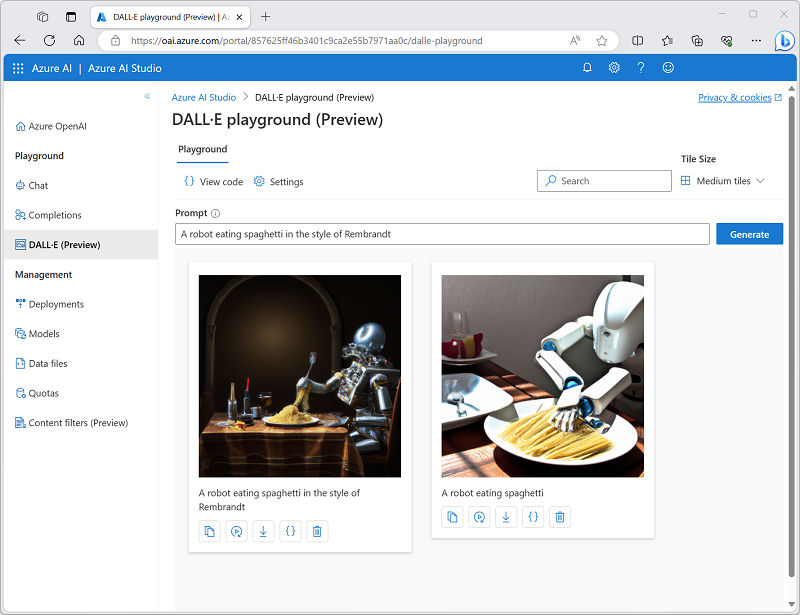

---
lab:
  title: Explorer Azure OpenAI Service
---

# Explorer Azure OpenAI

Azure OpenAI Service intègre les modèles d’IA générative développés par OpenAI à la plateforme Azure, ce qui vous permet de développer de puissantes solutions d’IA qui bénéficient de la sécurité, de la scalabilité et de l’intégration de services fournies par la plateforme cloud Azure.

Dans cet exercice, vous allez explorer Azure OpenAI Service et l’utiliser pour déployer et expérimenter avec des modèles d’IA générative.

Cet exercice prend environ **25** minutes.

## Avant de commencer

Vous aurez besoin d’un abonnement Azure approuvé pour l’accès au service Azure OpenAI Service pour les modèles de texte et de code et les modèles de génération d’images DALL-E.

- Pour obtenir un abonnement gratuit à Azure, visitez [https://azure.microsoft.com/free](https://azure.microsoft.com/free).
- Pour demander l’accès à Azure OpenAI Service, visitez [https://aka.ms/oaiapply](https://aka.ms/oaiapply).

## Provisionner une ressource Azure OpenAI

Avant de pouvoir utiliser des modèles Azure OpenAI, vous devez provisionner une ressource Azure OpenAI dans votre abonnement Azure.

1. Connectez-vous au [portail Azure](https://portal.azure.com).
2. Créez une ressource **Azure OpenAI** avec les paramètres suivants :
    - **Abonnement** : *Un abonnement Azure approuvé pour l’accès au service Azure OpenAI.*
    - **Groupe de ressources** : *Choisissez un groupe de ressources existant ou créez-en un avec le nom de votre choix.*
    - **Région** : *choisissez une région disponible*.
    - **Nom** : *Un nom unique de votre choix.*
    - **Niveau tarifaire** : Standard S0
3. Attendez la fin du déploiement. Accédez ensuite à la ressource Azure OpenAI déployée dans le portail Azure.

## Explorer Azure OpenAI Studio

Vous pouvez déployer, gérer et explorer des modèles dans Azure OpenAI Service à l’aide d’Azure OpenAI Studio.

1. Dans la page **Vue d’ensemble** de votre ressource Azure OpenAI, utilisez le bouton **Explorer** pour ouvrir Azure OpenAI Studio sous un nouvel onglet du navigateur. Vous pouvez aussi accéder à [Azure OpenAI Studio](https://oai.azure.com/) directement.

    Lorsque vous ouvrez Azure OpenAI Studio pour la première fois, il doit ressembler à ceci :

    

1. Affichez les pages disponibles dans le volet de gauche. Vous pouvez toujours revenir à la page d’accueil en haut. En outre, OpenAI Studio fournit plusieurs pages dans lesquelles vous pouvez :
    - Expérimentez avec des modèles dans un *terrain de jeu*.
    - Gérez les déploiements de modèles et les données.

## Déployer un modèle pour la génération de langage

Pour expérimenter avec la génération de langage naturel, vous devez d’abord déployer un modèle.

1. Dans la page **Modèles**, affichez les modèles disponibles dans votre instance de service Azure OpenAI.
1. Sélectionnez l’un des modèles **gpt-35-turbo** pour lesquels l’état **Déployable** est **Oui**, puis sélectionnez **Déployer** :

    

1. Créez un déploiement avec les paramètres suivants :
    - **Modèle** : gpt-35-turbo
    - **Version du modèle** : mise à jour automatique avec la valeur par défaut
    - **Nom du déploiement** : *Un nom unique pour votre modèle de déploiement*

## Utiliser le terrain de jeu *Conversation* pour travailler avec le modèle

Maintenant que vous avez déployé un modèle, vous pouvez l’utiliser dans le terrain de jeu *Conversation* pour générer une sortie en langage naturel à partir d’invites que vous envoyez dans une interface de conversation.

1. Dans [Azure OpenAI Studio](https://oai.azure.com/), accédez au terrain de jeu **de conversation** dans le volet gauche.

    Le terrain de jeu *Conversation* fournit une interface de chatbot avec laquelle vous pouvez interagir avec votre modèle déployé, comme illustré ici :

    

1. Dans le volet **Configuration**, vérifiez que votre déploiement de modèle est sélectionné.
1. Dans le volet **Configuration de l’assistant**, sélectionnez le modèle de message système **Par défaut** et affichez le message système créé par ce modèle. Le message système définit le comportement du modèle dans votre session de conversation.
1. Dans la section **Session de conversation**, saisissez le message utilisateur suivant.

    ```
   What is generative AI?
    ```

1. Observez la sortie retournée par le modèle, qui doit fournir une définition de l’IA générative.
1. Entrez le message utilisateur suivant en tant que question de suivi :

    ```
   What are three benefits it provides?
    ```

1. Passez en revue la sortie, en notant que la session de conversation a suivi l’entrée et la réponse précédentes pour fournir un contexte (de sorte qu’elle interprète correctement « elle » comme faisant référence à l’« IA générative ») et qu’elle fournit une réponse appropriée en fonction de ce qui a été demandé (elle doit retourner trois avantages de l’IA générative).

## Utiliser le terrain de jeu *DALL-E* pour générer des images

Outre les modèles de génération de langage, Azure OpenAI Service prend en charge le modèle DALL-E 2 pour la génération d’images.

> **Remarque** : Vous devez avoir demandé et reçu l’accès aux fonctionnalités DALL-E dans votre application d’accès au service Azure OpenAI pour effectuer cette section de l’exercice.

1. Dans [Azure OpenAI Studio](https://oai.azure.com/), accédez au terrain de jeu **DALL-E** dans le volet de gauche.
1. Entrez l’invite suivante :

    ```
    A robot eating spaghetti
    ```

1. Sélectionnez **Générer** et afficher les résultats, qui doivent être constitués d’une image basée sur la description que vous avez fournie dans l’invite, semblable à celle-ci :

    

1. Générez une deuxième image en modifiant l’invite en :

    ```
    A robot eating spaghetti in the style of Rembrandt
    ```
1. Vérifiez que la nouvelle image correspond aux exigences de l’invite, semblable à celle-ci :

    

## Nettoyage

Lorsque vous avez terminé avec votre ressource Azure OpenAI, n’oubliez pas de supprimer le déploiement ou l’intégralité de la ressource dans le [portail Azure](https://portal.azure.com/?azure-portal=true).
