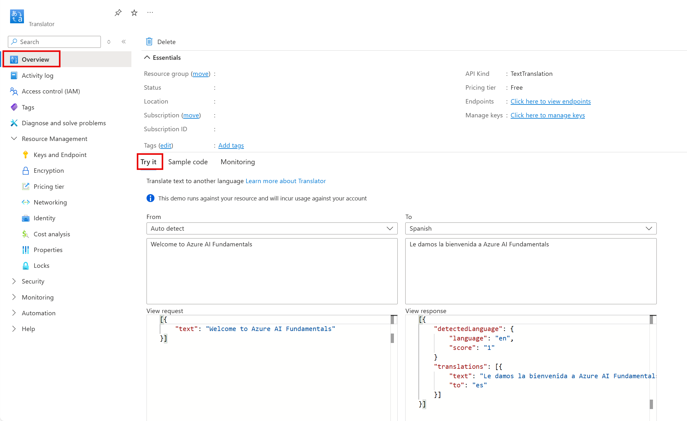

---
lab:
  title: "Explorer Azure\_AI\_Traducteur"
---

# Explorer Azure AI Traducteur

> **Remarque** Pour suivre ce labo, vous avez besoin d’un [abonnement Azure](https://azure.microsoft.com/free?azure-portal=true) dans lequel vous disposez d’un accès administratif.

L’intelligence artificielle (IA) peut simplifier la traduction dans différentes langues, ce qui contribue à éliminer les obstacles à la communication entre les pays et les cultures.

Pour tester les fonctionnalités du service Azure AI Traducteur, nous allons voir comment il fonctionne dans le portail Azure. Les mêmes principes et fonctionnalités s’appliquent aux solutions réelles, telles que des sites web ou applications téléphoniques.

## Créer une ressource pour *Traducteur*

Vous pouvez utiliser le service Translator en créant une ressource **Translator** ou une ressource  **Azure AI services**.

Pour cet exercice, créez une ressource **Traducteur** dans votre abonnement Azure.

1. Sous un autre onglet de navigateur, ouvrez le portail Azure à l’adresse [https://portal.azure.com](https://portal.azure.com?azure-portal=true) en vous connectant avec votre compte Microsoft.

1. Cliquez sur le bouton **&#65291;Créer une ressource** et recherchez *Traducteur*. Sélectionnez **Créer**. Vous accédez à une page pour créer une ressource Traducteur. Configurez-la avec les paramètres suivants :
    - **Abonnement** : *votre abonnement Azure*.
    - **Groupe de ressources** : *sélectionnez ou créez un groupe de ressources portant un nom unique*.
    - **Région** : *choisissez une région disponible*.
    - **Nom** : *entrez un nom unique.*
    - **Niveau tarifaire** : Standard S0

1. Examinez et créez la ressource, puis attendez la fin du déploiement. Accédez ensuite à la ressource déployée.

## Explorer le service Traducteur 

Nous pouvons explorer les fonctionnalités du service Traducteur dans le portail Azure. 

1. Dans le portail Azure, dans la ressource déployée, consultez la page *Vue d’ensemble*.

    

1. Dans la section *Essayer* de la page Vue d’ensemble, sous la section *De : détection automatique*, entrez le texte `Welcome to Azure AI Fundamentals`. Notez le JSON qui apparaît en correspondance dans la section *Afficher la requête*. 

1. Dans la section *Afficher la réponse*, affichez le JSON. En arrière-plan, une *requête* a été envoyée au service Traducteur. La *réponse* inclut la langue source détectée avec un score de confiance, une traduction utilisant l’alphabet de la langue de sortie et un code de langue de sortie. 

1. La démonstration de la section *Essayer* montre à quoi ressemblerait une application de traduction simple dotée d’une interface utilisateur. Dans le cas de la démonstration, dès que vous entrez du texte, une requête est adressée au service Traducteur. Comment pouvez-vous faire cette reuqête ? Consultez l’onglet *Exemple de code*. Vous voyez ici des exemples de code dans différents langages de programmation qui peuvent être utilisés pour effectuer la requête. 

1. Identifiez les lignes dans les exemples de code dans lesquels vous devez inclure la **clé** et le **point de terminaison** de votre service Traducteur. Avec votre clé et votre point de terminaison, vous pouvez envoyer une requête au service Traducteur et recevoir une réponse comme vous l’avez vu dans la démonstration. 

1. Accédez au menu de gauche. Sous *Gestion des ressources*, sélectionnez *Clés et points de terminaison*. Si vous voulez créer une application, vous trouverez ici votre clé et votre point de terminaison. 

## Nettoyage

1. Supprimez votre ressource une fois que vous l’avez utilisée. 

## En savoir plus

Pour en savoir plus sur ce que ce service est capable de faire, consultez la [page Traducteur](https://learn.microsoft.com/en-us/azure/ai-services/translator/translator-overview).
