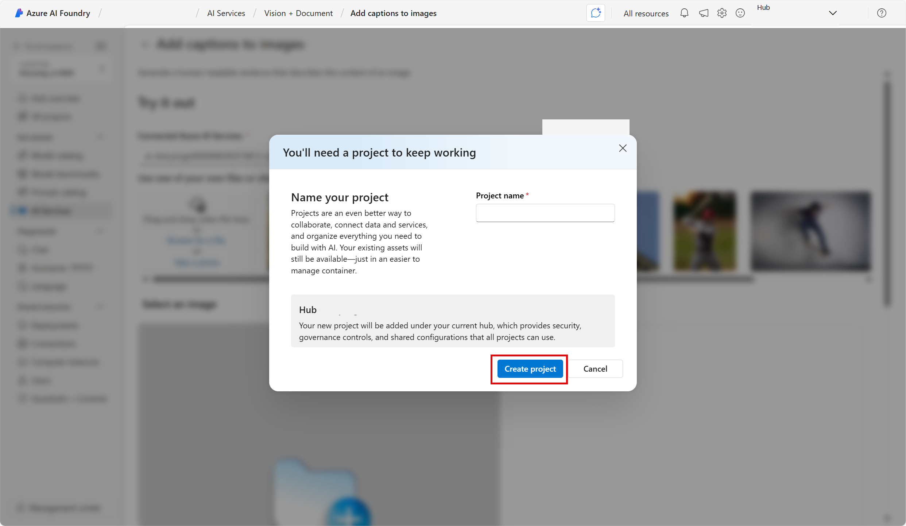
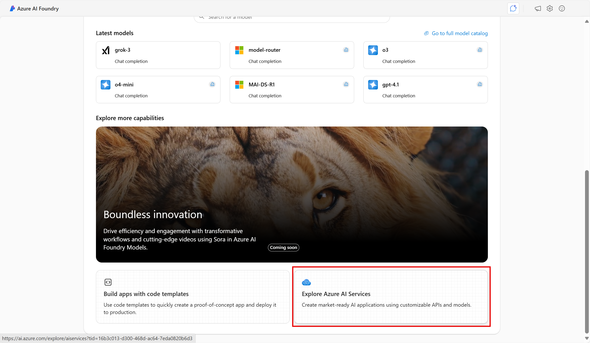
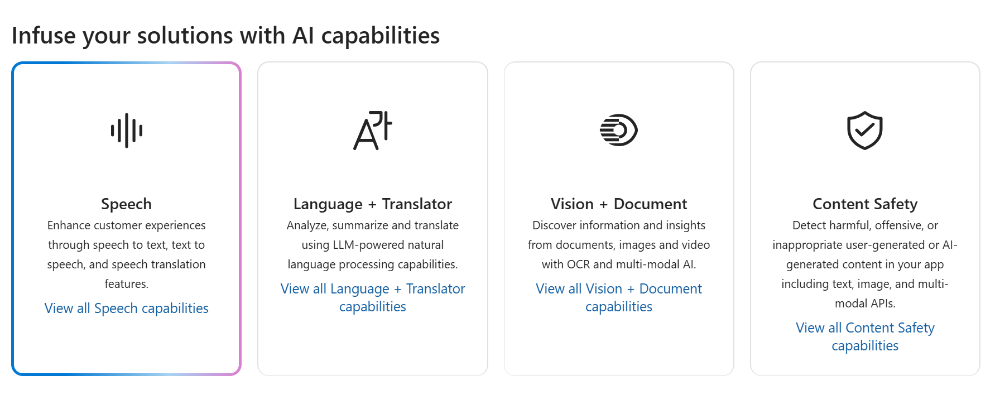

---
lab:
  title: "Explorer Speech dans le portail Azure\_AI\_Foundry"
---

# Explorer Speech dans le portail Azure AI Foundry

Le service **Azure AI Speech** transcrit la parole en texte et le texte en parole audible. Vous pouvez utiliser AI Speech pour créer une application capable de transcrire des notes de réunion ou de générer du texte à partir de l'enregistrement d'entretiens.

Dans cet exercice, vous allez utiliser Azure AI Speech dans le portail Azure AI Foundry, la plateforme de Microsoft pour la création d’applications intelligentes, afin de transcrire l’audio à l’aide des expériences de test intégrées. 

## Créer un projet dans le portail Azure AI Foundry

1. Dans un onglet de navigateur, accédez à [Azure AI Foundry](https://ai.azure.com?azure-portal=true).

1. Connectez-vous avec votre compte. 

1. Sur la page d’accueil du portail Azure AI Foundry, sélectionnez **Créer un projet**. Dans Azure AI Foundry, les projets sont des conteneurs qui aident à organiser votre travail.  

    

1. Dans le volet *Créer un projet*, vous verrez un nom de projet généré, que vous pouvez conserver en l’état. Selon que vous avez créé un hub par le passé, vous verrez une liste de *nouvelles* ressources Azure à créer ou une liste déroulante de hubs existants. Si vous voyez la liste déroulante des hubs existants, sélectionnez *Créer un hub*, créez un nom unique pour votre hub, puis sélectionnez *Suivant*.  
 
    

> **Important** : vous aurez besoin d’une ressource de services Azure AI configurée dans un emplacement spécifique pour effectuer le reste du labo.

1. Dans le même volet *Créer un projet*, sélectionnez **Personnaliser** et sélectionnez l’un des **emplacements** suivants : USA Est, France Centre, Corée Centre, Europe Ouest ou USA Ouest pour terminer le reste du labo. Sélectionnez ensuite **Créer**. 

1. Notez les ressources créées : 
- Azure AI services
- Azure AI Hub
- Projet Azure AI
- Compte de stockage
- Key vault
- Resource group  
 
1. Une fois les ressources créées, vous serez redirigé vers la page *Vue d’ensemble* de votre projet. Dans le menu de gauche de l’écran, sélectionnez **Services d’IA**.
 
      

1. Dans la page *Services d’IA*, sélectionnez la vignette *Speech* pour essayer les fonctionnalités d’Azure AI Speech.

    

## Explorer la reconnaissance vocale dans le terrain de jeu Speech d’Azure AI Foundry

Essayons la *reconnaissance vocale en temps réel* dans le terrain de jeu Speech d’Azure AI Foundry. 

1. Dans la page *Speech*, faites défiler vers le bas et sélectionnez **Reconnaissance vocale en temps réel** dans *Essayer les fonctionnalités Speech*. Vous serez dirigé vers le *terrain de jeu Speech*. 

1. Sélectionnez [**https://aka.ms/mslearn-speech-files**](https://aka.ms/mslearn-speech-files) pour télécharger **speech.zip**. Ouvrez le dossier . 

1. Dans *Charger les fichiers*, sélectionnez **Parcourir les fichiers** et accédez au dossier dans lequel vous avez enregistré le fichier. Sélectionnez **WhatAICanDo.m4a**, puis **Ouvrir**.

    

1. Le service Speech transcrit et affiche le texte en temps réel. Si vous disposez d'un système audio sur votre ordinateur, vous pouvez écouter l'enregistrement pendant la transcription du texte.

1. Passez en revue la sortie, qui aurait normalement reconnu et transcrit l’audio en texte.

Dans cet exercice, vous avez essayé les services Azure AI Speech dans le terrain de jeu Speech d’Azure AI Foundry. Vous avez ensuite utilisé la reconnaissance vocale en temps réel pour transcrire un enregistrement audio. Vous avez pu voir la transcription du texte générée au fur et à mesure de la lecture du fichier audio.

## Nettoyage

Si vous n’avez pas l’intention d’effectuer plus d’exercices, supprimez les ressources dont vous n’avez plus besoin. Cela évite d’accumuler des coûts inutiles.

1. Ouvrez le [portail Microsoft Azure]( https://portal.azure.com) et sélectionnez le groupe de ressources qui contient la ressource que vous avez créée.
1. Sélectionnez la ressource, puis sélectionnez **Supprimer**, puis **Oui** pour confirmer. La ressource est alors supprimée.

## En savoir plus

Cet exercice n’a démontré que quelques fonctionnalités du service Speech. Pour en savoir plus sur ce que ce service est capable de faire, consultez la [page Speech](https://azure.microsoft.com/services/cognitive-services/speech-services).
