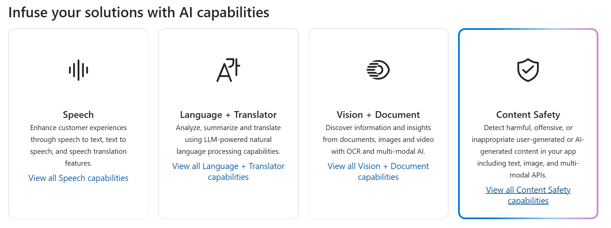

---
lab:
  title: "Explorer la sécurité du contenu dans Azure\_AI\_Foundry"
---

# Explorer la sécurité du contenu dans Azure AI Foundry

Azure AI services aide les utilisateurs à créer des applications avec des API et modèles prêts à l’emploi, prédéfinis et personnalisables. Dans cet exercice, vous allez examiner l’un des services, Azure AI Sécurité du Contenu, qui vous permet de modérer le contenu des textes et des images. Dans le portail Azure AI Foundry, la plateforme de Microsoft pour la création d’applications intelligentes vous permet d’utiliser Azure AI Sécurité du Contenu pour catégoriser le texte et lui attribuer un score de gravité. 

> **Remarque** L’objectif de cet exercice est d’avoir une idée générale de la façon dont les services Azure AI services sont provisionnés et utilisés. Content Safety est utilisé à titre d’exemple, vous n’êtes pas censé devenir un expert en sécurité du contenu après cet exercice.

## Créer un projet dans le portail Azure AI Foundry

1. Dans un onglet de navigateur, accédez au [portail Azure AI Foundry](https://ai.azure.com?azure-portal=true).

2. Connectez-vous avec votre compte. 

3. Sur la page d’accueil du portail Azure AI Foundry, sélectionnez **Créer un projet**. Dans Azure AI Foundry, les projets sont des conteneurs qui aident à organiser votre travail.  

    

4. Dans le volet *Créer un projet*, vous verrez un nom de projet généré, que vous pouvez conserver en l’état. Selon que vous avez créé un hub par le passé, vous verrez une liste de *nouvelles* ressources Azure à créer ou une liste déroulante de hubs existants. Si vous voyez la liste déroulante des hubs existants, sélectionnez *Créer un hub*, créez un nom unique pour votre hub, puis sélectionnez *Suivant*.  
 
    

> **Important** : vous aurez besoin d’une ressource de services Azure AI configurée dans un emplacement spécifique pour effectuer le reste du labo.

5. Dans le même volet *Créer un projet*, sélectionnez **Personnaliser** et sélectionnez l’un des **emplacements** suivants : USA Est, France Centre, Corée Centre, Europe Ouest ou USA Ouest pour terminer le reste du labo. Sélectionnez ensuite **Créer**. 

1. Notez les ressources créées : 
- Azure AI services
- Azure AI Hub
- Projet Azure AI
- Compte de stockage
- Key vault
- Resource group  

6. Une fois les ressources créées, vous serez redirigé vers la page *Vue d’ensemble* de votre projet. 

7. Pour utiliser la Sécurité du Contenu, vous devez effectuer une mise à jour des autorisations sur votre ressource *Azure AI Hub*. Pour ce faire, ouvrez le [portail Azure](https://portal.azure.com?portal-azure=true) et connectez-vous avec le même abonnement que celui que vous avez utilisé pour créer vos ressources AI Foundry.  

8. Dans le portail Azure, utilisez la barre de recherche en haut de la page pour rechercher et sélectionner **Azure AI Foundry**. Dans la page de ressources, sélectionnez la ressource que vous venez de créer qui est de *type***Azure AI Hub**.  

9. Dans le portail Azure, dans le volet gauche, sélectionnez **Access Control (IAM)**. Ensuite, dans le volet ouvert, sélectionnez **Ajouter** en regard du signe plus, puis sélectionnez **Ajouter une attribution de rôle**. 

10. Recherchez l’**évaluateur de sécurité Azure AI** dans la liste des rôles, puis sélectionnez-le. Sélectionnez ensuite **Suivant**. 

11. Utilisez les paramètres suivants pour vous attribuer le rôle : 
    - **Attribuer l’accès à** : sélectionnez *Utilisateur, groupe ou principal de service*
    - **Membres** : cliquez sur *Sélectionner des membres*
        - Dans le volet *Sélectionner des membres*, recherchez votre nom. Cliquez sur l’icône plus en regard de votre nom. Puis cliquez sur **Sélectionner**.
    - **Description** : *laissez vide*

12. Sélectionnez **Passer en revue et attribuer**, puis à nouveau **Passer en revue et attribuer** pour ajouter l’attribution de rôle.    

13. Dans votre navigateur, revenez au [portail Azure AI Foundry](https://ai.azure.com?azure-portal=true). Sélectionnez votre projet. 

14. Dans le menu de gauche de l’écran, sélectionnez **Services d’IA**.
 
      

15. Dans la page *Services d’IA*, sélectionnez la vignette *Vision + Document* pour essayer les fonctionnalités Azure AI Vision et Document.
    
    

## Essayer la modération du texte avec la Sécurité du Contenu dans le portail Azure AI Foundry 

1. Sur la page *Sécurité du Contenu*, dans *Filtrer le contenu du texte*, sélectionnez **Modérer le contenu de texte**.

2. Dans la page *Modérer le contenu du texte*, dans le titre *Essayer*, sélectionnez la ressource Azure AI Services que vous venez de créer dans le menu déroulant.   

3. Dans *Exécuter un test simple*, sélectionnez la vignette **Sécurité du Contenu**. Le texte est affiché dans la zone ci-dessous. 

4. Cliquez sur **Run test**. L’exécution d’un test appelle le modèle Deep Learning de Content Safety Service. Le modèle Deep Learning a déjà été entraîné pour reconnaître le contenu non sécurisé.

5. Dans le panneau *Résultats*, examinez les résultats. Il y a quatre niveaux de gravité allant de sécurisé à élevé, et quatre types de contenu nuisible. Le service AI Sécurité du Contenu considère-t-il cet exemple comme acceptable ou non ? Il est important de souligner que les résultats se situent dans un intervalle de confiance. Un modèle bien entraîné, comme l’un des modèles prêts à l’emploi d’Azure AI, peut retourner des résultats qui ont une forte probabilité de correspondre à ce qu’un humain qualifierait pour le résultat. Chaque fois que vous exécutez un test, vous appelez à nouveau le modèle. 

6. Essayez maintenant un autre échantillon. Sélectionnez le texte sous Contenu violent avec une faute d’orthographe. Vérifiez que le contenu s’affiche dans la zone ci-dessous.

7. Cliquez sur **Exécuter le test** et examinez à nouveau les résultats dans le panneau Résultats. 

Vous pouvez exécuter des tests sur tous les exemples fournis, puis examiner les résultats.

## Nettoyage

Si vous n’avez pas l’intention d’effectuer plus d’exercices, supprimez les ressources dont vous n’avez plus besoin. Cela évite d’accumuler des coûts inutiles.

1. Ouvrez le [portail Microsoft Azure]( https://portal.azure.com) et sélectionnez le groupe de ressources qui contient la ressource que vous avez créée.
1. Sélectionnez la ressource, puis sélectionnez **Supprimer**, puis **Oui** pour confirmer. La ressource est alors supprimée.

## En savoir plus

Cet exercice n’a démontré que quelques fonctionnalités du service Sécurité du Contenu. Pour en savoir plus sur ce que ce service est capable de faire, consultez la [page Sécurité du Contenu](https://learn.microsoft.com/azure/ai-services/content-safety/overview).